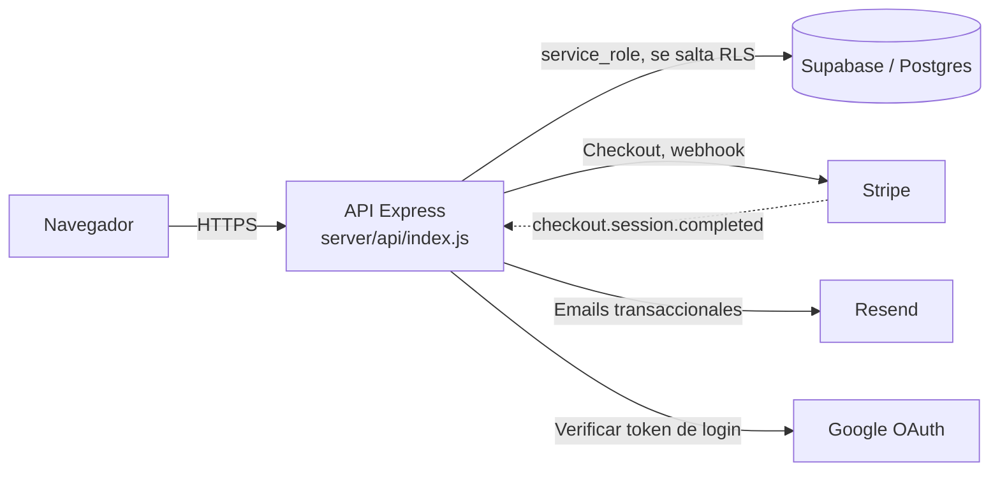
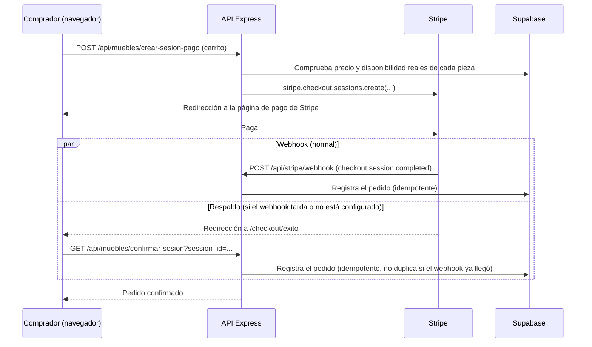
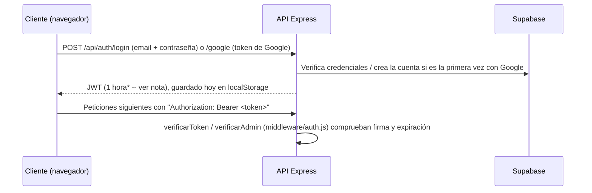

# Arquitectura

Vista general de cómo se conectan las piezas. Para el detalle de cada decisión de seguridad o de
diseño de base de datos, este documento enlaza a `docs/mejoras-tecnicas.md` y
`docs/tarea3-diseno.md` en vez de repetirlo.

## Vista general

`client/` (React) solo habla con `server/` (Express) -- nunca con Supabase, Stripe o Resend
directamente. El servidor es el único que tiene la clave `service_role` de Supabase, las claves
de Stripe/Resend y valida el token de Google.

## Flujo de compra

El id del pedido se deriva de forma determinista del `session_id` de Stripe (UUID v5), así que
si el webhook y la página de éxito llegan a la vez, ambos intentan escribir la misma fila: uno
gana, el otro recibe un error de clave duplicada y lo trata como éxito (ya está registrado). El
detalle completo -- por qué el webhook responde 500 en fallos transitorios, por qué la
metadata de Stripe se reparte en varias claves, qué pasa si una pieza se vende dos veces a la
vez -- está en `docs/mejoras-tecnicas.md` (hallazgos H1, H4, H5) y en el propio
`server/src/utils/pagos.js`.

## Flujo de autenticación

**\*Pendiente, tarea 3b:** hoy el JWT dura 7 días y no hay refresh -- cuando caduca, hay que
volver a iniciar sesión. La tarea 3b (diseño completo en `docs/tarea3-diseno.md`) cambia esto a
un access token de 1 hora + un refresh token con rotación y detección de reuso (tabla
`refresh_tokens`, todavía no creada), y mueve el access token de `localStorage` a memoria. Nada
de esto está implementado todavía: esta sección describe el estado **actual**, no el objetivo.

## Decisiones técnicas clave (consolidado, con enlace al detalle)

| Decisión | Por qué | Detalle |
|---|---|---|
| El servidor usa siempre `service_role`, nunca `anon` | El servidor ya comprueba permisos de admin; depender de RLS pensado para el navegador escondía fallos | `docs/mejoras-tecnicas.md`, tarea 2 |
| CSP del servidor: `default-src 'none'` | La API solo devuelve JSON, no sirve HTML ni ejecuta nada en un navegador | `docs/mejoras-tecnicas.md`, tarea 2 |
| CORS con lista exacta de orígenes, sin comodín | Un comodín `*.vercel.app` lo podría satisfacer cualquiera con un proyecto propio en Vercel | `docs/mejoras-tecnicas.md`, tarea 2 |
| Zod valida toda entrada de usuario | Antes de la tarea 2, algunos errores internos se devolvían tal cual al cliente | `docs/mejoras-tecnicas.md`, tarea 2 |
| Migraciones con la herramienta nativa de Supabase, espejadas en `server/migrations/` | Ya había 7 migraciones aplicadas así; una herramienta externa fragmentaría el historial | `docs/tarea3-diseno.md`, Sección 1 |
| `CREATE INDEX` sin `CONCURRENTLY` en las migraciones de esta rama | Probado contra la base real: la herramienta de migraciones envuelve el SQL en una transacción, y `CONCURRENTLY` no puede correr dentro de una. Con la cantidad de filas actual, el lock de un `CREATE INDEX` normal es imperceptible | `docs/mejoras-tecnicas.md`, "Tarea 3: migraciones" |
| JWT con refresh y rotación (tarea 3b) | Detección de reuso de tokens robados, y no depender de un access token de larga vida | `docs/tarea3-diseno.md`, Sección 2 |
