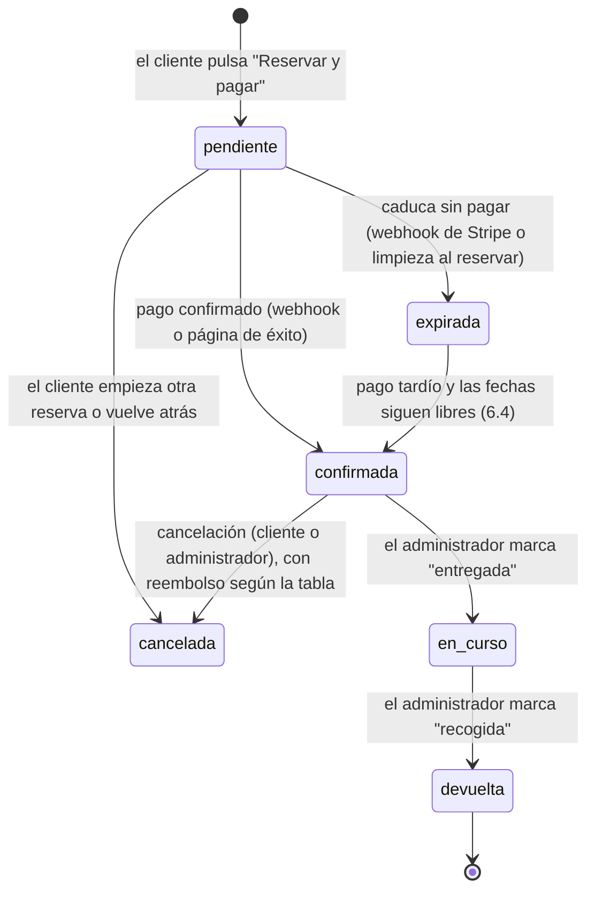

# Reservas por fechas — Diseño

> **Estado: BORRADOR — pendiente de confirmación del cliente** (23 sep 2026). Primera revisión técnica hecha y
> sus cambios incorporados; queda la revisión en detalle de las secciones 3, 4 y 6. **No se implementa nada hasta
> tener las tres decisiones bloqueantes del cliente** (10.1: modelo de fianza, sesión obligatoria y alquiler fuera
> de la cesta, y cómo se cuentan los días) **y hasta cerrar la tarea 3.**

Diseño de la nueva funcionalidad de **alquiler de muebles por rango de fechas** ("como un hotel"). Es un
documento de diseño: no hay código, no se ha aplicado ninguna migración y no se ha tocado `main`. Vive en la
rama `feature/reservas-diseno`, sacada de `main` para no mezclarse con las migraciones de la tarea 3, que
siguen su propio curso en `feature/mejoras-tecnicas`.

**Todo lo que este documento afirma sobre el sistema actual está comprobado, no supuesto** (23 sep 2026):

- Código leído: `server/src/utils/pagos.js`, `controllers/mueblesController.js`, `controllers/stripeController.js`,
  `utils/metadataStripe.js`, `middleware/auth.js`, `controllers/authController.js`, las rutas, y en el cliente
  `ProductDetail.jsx`, `CartContext.jsx`, `CheckoutModal.jsx`, `CartDrawer.jsx`, `Admin.jsx`, `Terms.jsx` y todos
  los sitios que mencionan el alquiler.
- Base de datos real (proyecto `gdrmpxcpucmaxvtpljge`), **solo lectura**: columnas, restricciones, índices,
  disparadores, funciones, extensiones disponibles y recuentos.
- Documentación externa: Stripe (retenciones de tarjeta, autorización ampliada, creación, actualización y caducidad
  de sesiones de Checkout, reembolsos), Vercel (límites de Cron Jobs) y el texto consolidado del BOE de los
  artículos que cita el cliente.

Las decisiones del cliente (preguntas, respuestas y tabla de valores sugeridos frente a decisiones firmes) están
en Notion; ver [Referencias](#referencias).

---

## 1. Resumen ejecutivo

**Qué es.** Hoy un mueble se puede comprar o "alquilar por días" sin fechas: el alquiler cobra **un solo día**
(`precio_alquiler_dia × 1`) y deja la pieza en `alquilado` para siempre hasta que el administrador la reponga a
mano (hallazgo H7 de `mejoras-tecnicas.md`). La nueva funcionalidad permite reservar un mueble **entre dos
fechas**: calendario de disponibilidad en la ficha, precio total calculado en el servidor con descuentos por
duración y coste de entrega/recogida desglosados antes de pagar, varias reservas futuras por pieza sin
solaparse, gestión del ciclo de vida de cada reserva y calendario en el panel de administración.

**Qué cambia en el modelo de datos.**
- Una tabla nueva, `reservas`, que registra **todo lo que ocupa el calendario de un mueble**: alquileres,
  bloqueos manuales del administrador y ventas. Una restricción de exclusión de Postgres (`EXCLUDE USING gist`)
  garantiza en la propia base de datos que nada de eso se solapa, incluido el margen logístico entre reservas.
- `muebles.estado` pasa a ser un valor **derivado** de esa tabla (vendido / alquilado ahora mismo / disponible),
  recalculado por un disparador, en vez de un campo que se edita a mano.
- `pedidos` no se normaliza: las líneas de alquiler ganan fechas y `reserva_id` dentro del mismo `items` jsonb.
- Una columna opcional nueva en `muebles` (`fianza_alquiler`) si se confirma una fianza por pieza.

**Bloques de trabajo** (detalle en la sección 11): **R-a** esquema y lectura (tabla, restricción, precios y
disponibilidad de solo lectura), sin nada que escriba y sin cambios visibles · **R-b** servidor con escritura
(reserva y pago, y que la compra respete las reservas) · **R-c** cliente (calendario,
checkout de reserva, "Mis reservas") · **R-d** administración (lista y acciones; después, calendario por pieza y
vista general) · **R-e** fianza y tareas programadas · **R-f** migración de datos y lanzamiento.

**Estimación de esfuerzo.** Unos **14–21 días de desarrollo** para una persona, con un margen de error
razonable de ±30 %. **No incluye** el tiempo de espera de decisiones del cliente, la redacción de los T&C por su
asesor legal ni las dos pausas de despliegue de 24–48 h (tras el cambio en la compra y tras el lanzamiento; mismo
patrón que la tarea 3).

**Lo que hay que resolver antes de implementar:**
1. **La fianza "preautorizada" que pidió el cliente no es viable tal cual.** Stripe solo mantiene una retención
   de tarjeta en pagos online **7 días** (30 con autorización ampliada, y solo en casos muy concretos). Un
   alquiler de hasta 180 días no cabe. El cliente tiene que elegir entre cobrar la fianza y devolverla (A,
   recomendada en la revisión), guardar la tarjeta y cobrar solo si hay daños (B) o no pedir fianza (C) (6.6).
2. **Dos decisiones de experiencia que son del cliente:** si reservar exige iniciar sesión con un flujo propio
   fuera de la cesta (T8, T9), y si del día 1 al 3 son 2 días o 3 (T3). Junto con la fianza, son las tres
   **bloqueantes de diseño** (10.1).
3. **El art. 103.l del TRLGDCU, que según el cliente exime del desistimiento de 14 días, no menciona el
   alquiler de muebles** (menciona alojamiento, transporte de bienes, alquiler de vehículos, comida y ocio). Lo
   confirma su asesor legal; mientras tanto, la política de cancelación es configurable y arranca en "manual,
   decide el administrador" (8.4), así que no bloquea el desarrollo.
4. **Empezar a implementar después de cerrar la tarea 3** (3a con A3/A4 y B, y el bloque 3b de autenticación).
   Los calendarios del administrador, además, después del refactor de `Admin.jsx` (tarea 4). La lista mínima
   de reservas que hace falta para lanzar no depende de esa tarea (sección 11).

---

## 2. Decisiones firmes y valores por defecto

**FIRME** = decisión explícita del cliente o exigencia legal: cambiarla implica rediseño. **DEFAULT** = valor de
ejemplo del cliente o decisión técnica mía que se guarda como configuración o se puede cambiar sin rediseñar;
cada DEFAULT lleva la marca **"confirmar con el cliente antes de implementar"**.

### 2.1 Reglas de negocio

| Regla | Tipo | Valor | Fundamento | Dónde vive en el diseño |
|---|---|---|---|---|
| Un mueble puede estar a la venta y en alquiler a la vez | FIRME | — | Decisión del cliente | Modelo (3) |
| Varias reservas futuras por pieza, sin solaparse y con margen | FIRME | — | Decisión del cliente | Restricción de exclusión (4) |
| Prohibido vender con reservas activas o futuras; el botón de compra se bloquea | FIRME | — | [Art. 1091 CC](https://www.boe.es/buscar/act.php?id=BOE-A-1889-4763#art1091) | Venta como ocupación del calendario (3.2, 6.7) |
| Excepción: entrega diferida posterior a la última reserva, o cancelación formal de los arrendatarios | FIRME | — | Decisión del cliente | Venta con `fecha_inicio` diferida (6.7) |
| Desglose del precio total (base, descuento, envío, fianza, impuestos) **antes** del pago | FIRME | — | [Art. 60](https://www.boe.es/buscar/act.php?id=BOE-A-2007-20555#a60) y [art. 97](https://www.boe.es/buscar/act.php?id=BOE-A-2007-20555#a97) TRLGDCU | Presupuesto del servidor + checkout (5, 6) |
| Todo alquiler tiene fecha de fin | FIRME | — | [Art. 1543 CC](https://www.boe.es/buscar/act.php?id=BOE-A-1889-4763#art1543) | `fecha_fin` obligatoria; legado (9) |
| Existe margen logístico automático entre reservas | FIRME | — | Evitar mora con la reserva siguiente | `dias_margen` (3, 4) |
| Existe fianza, con supuestos de retención en los T&C | FIRME | — | Decisión del cliente | 6.6 |
| Existe cláusula penal por retraso | FIRME | — | [Art. 1152 CC](https://www.boe.es/buscar/act.php?id=BOE-A-1889-4763#art1152) y [art. 1255 CC](https://www.boe.es/buscar/act.php?id=BOE-A-1889-4763#art1255) | 8, 6.6 |
| Mecanismo de la fianza: preautorización durante todo el alquiler | FIRME según el cliente, **no viable** | — | Límites de Stripe (6.6) | **Decisión nueva necesaria del cliente: A, B o C (6.6)** |
| Duración mínima | DEFAULT — confirmar con el cliente antes de implementar | 1 día (24 h) | Art. 1255 CC | Configuración |
| Duración máxima | DEFAULT — confirmar con el cliente antes de implementar | 180 días | Art. 1255 CC | Configuración |
| Antelación mínima | DEFAULT — confirmar con el cliente antes de implementar | 2 días (48 h) | Preparación del envío | Configuración |
| Antelación máxima | DEFAULT — confirmar con el cliente antes de implementar | 6 meses | — | Configuración |
| Margen entre reservas | DEFAULT — confirmar con el cliente antes de implementar | 2 días (el cliente dijo 24–48 h; tomo el extremo seguro) | — | Configuración, copiada en cada reserva |
| Descuentos por duración | DEFAULT — confirmar con el cliente antes de implementar | Tramos semana (≥ 7 días) y mes (≥ 30 días); porcentajes sin definir | Art. 1255 CC | Configuración (5.2) |
| Política de cancelación | DEFAULT: **`manual`** (sin reembolso automático; decide el administrador) hasta que el asesor legal valide la tabla del cliente | Tabla propuesta por el cliente: > 7 días: 100 % · de 7 días a 2 días: 50 % · < 2 días: 0 % | [Art. 103.l TRLGDCU](https://www.boe.es/buscar/act.php?id=BOE-A-2007-20555#a103), **pendiente de confirmar** | Configuración (8.4) |
| Penalización por retraso | DEFAULT — confirmar con el cliente antes de implementar | Doble tarifa diaria por día de retraso | Arts. 1152 y 1255 CC | Configuración (8.5) |
| Plazo de liberación de la fianza | DEFAULT — confirmar con el cliente antes de implementar | Hasta 14 días naturales tras la devolución | — | Configuración (6.6) |
| Entrega y recogida: incluidas o aparte | **SIN DECIDIR** — hay que decidirlo antes de lanzar | Tarifa fija por trayecto, 0 € = incluido | Art. 97 TRLGDCU | Configuración (5.3) |

### 2.2 Decisiones técnicas que he tomado por defecto

Ninguna de estas estaba especificada. Todas se pueden cambiar; las marcadas con ⚑ cambian el modelo de datos,
así que conviene revisarlas **antes** de aprobar el diseño.

| # | Decisión | Por qué | Alternativa descartada |
|---|---|---|---|
| T1 ⚑ | **Una sola tabla `reservas` con `tipo` (`alquiler` / `bloqueo` / `venta`)**, en vez de `reservas` + `bloqueos_admin` por separado | Una restricción de exclusión solo actúa dentro de una tabla. Alquileres, bloqueos y ventas tienen que excluirse **entre sí**: con una tabla, Postgres lo garantiza sin una línea de código de bloqueo | Tablas separadas + funciones SQL que bloqueen la fila del mueble (sección 4.5, plan B) |
| T2 ⚑ | **Granularidad de día** (`date`), zona `Europe/Madrid` para calcular "hoy", nunca UTC (3.6, incluidos los cambios de hora). `fecha_inicio` = día de entrega, `fecha_fin` = día de recogida | El cliente habla de días (24 h, 48 h, 180 días) y de "como un hotel". Las horas complicarían el calendario sin aportar nada | `timestamptz` con franjas horarias |
| T3 | **Días facturados = `fecha_fin − fecha_inicio`** (como las noches de hotel): entrega el lunes 1 y recogida el miércoles 3 son 2 días | Coherente con el rango `[)` y con "mínimo 24 h" | Contar ambos extremos (3 días). **Bloqueante de diseño, lo decide el cliente** (10.1): es la pregunta clásica del alquiler, y si el cliente espera lo contrario todos los precios salen mal |
| T4 ⚑ | **Reserva provisional (`pendiente`) al crear la sesión de pago**, que vive lo mismo que la sesión de Stripe más 15 min de gracia (30 + 15 min con los valores por defecto; duración configurable, 6.3), en vez de crear la reserva solo cuando llega el webhook | Sin reserva provisional, dos clientes pueden pagar las mismas fechas y el segundo cobro hay que reembolsarlo después. Con ella, el segundo no llega a pagar. Las abandonadas se limpian sin ningún proceso programado (4.6) | Crear la reserva en el webhook y reembolsar el conflicto (sección 6.4) |
| T5 ⚑ | `en_curso` y `devuelta` se marcan por **evento** (el administrador confirma entrega y recogida). `retrasada` es una condición **calculada** (en curso y pasada su fecha de fin), no un estado guardado | Un disparador no puede reaccionar al paso del tiempo; guardar estados que dependen del reloj obliga a un proceso programado del que dependería la disponibilidad | Estados por fecha actualizados por un cron |
| T6 ⚑ | Columna `fin_ocupacion` (fin **operativo**) separada de `fecha_fin` (fin **contractual**) | Una devolución tardía debe seguir ocupando el calendario; ampliar `fin_ocupacion` choca contra la reserva siguiente y hace saltar el aviso justo cuando hace falta | Detectar retrasos solo en el panel, sin reflejarlos en la disponibilidad |
| T6b ⚑ | Una reserva `devuelta` **sigue dentro de la restricción**, con `fin_ocupacion` = día real de devolución | Protege el margen pactado después de la devolución real, sin depender de la configuración vigente ni de la antelación (3.4) | Sacarla de la restricción y confiar en "antelación mínima ≥ margen" (fallaba al cambiar la configuración) |
| T7 | El margen se **copia en cada reserva** (`dias_margen`) en el momento de crearla | Cambiar la configuración no altera reservas ya pactadas | Calcularlo siempre desde la configuración actual |
| T8 | **Propuesta, pendiente del cliente (bloqueante de diseño):** reservar exige haber iniciado sesión, también en el servidor | Hace falta identificar al arrendatario (contrato, "Mis reservas", cancelaciones). Hoy `crear-sesion-pago` no exige sesión en el servidor, solo la pide la interfaz | Reserva como invitado con email |
| T9 | **Propuesta, pendiente del cliente (bloqueante de diseño):** el alquiler no pasa por la cesta; flujo propio desde la ficha, **una pieza por reserva** en la primera versión | Stripe, entrega, cancelación y fianza son distintos a los de la compra. Es un cambio grande de experiencia: si el cliente espera "añadir a la cesta y pagar como en la compra", hay que rediseñar el 6.1 antes de implementar | Cesta mixta (6.1) |
| T10 | Reglas de alquiler y descuentos como **constantes de código** en un único módulo de configuración; importes en **céntimos enteros** | Cambiarlas es un despliegue revisado, sin migraciones. Los céntimos evitan errores de coma flotante | Tabla `descuentos_duracion` editable desde el panel (se puede añadir después sin tocar reservas) |
| T11 | Disponibilidad **sin caché** (`Cache-Control: no-store`) y un endpoint de presupuesto aparte | La corrección la garantiza la base de datos al reservar; lo único que se juega la caché es la experiencia, y el tráfico es mínimo | `s-maxage` corto (7) |
| T12 | Conflicto detectado **después** de cobrar → aviso al administrador y reembolso manual | Es el patrón que ya existe para la doble venta (`pagos.js`, H5) | Reembolso automático (se puede activar más adelante) |
| T12b | Los datos de contacto del arrendatario se guardan en la reserva (`datos_contacto`) y **no** viajan en la metadata de Stripe | La metadata queda en `tipo` + `reserva_id`, así que no se repite H1 (500 caracteres por valor). La fila de la reserva ya es la fuente de verdad | Reutilizar `construirMetadataPago` como en la compra |
| T13 | En la primera versión, **las cancelaciones las ejecuta el administrador**, con la política de cancelación configurada (`manual` por defecto, 8.4) | Mueve dinero y la validez legal de la tabla está por confirmar | Autoservicio del cliente con reembolso automático (fase 2) |
| T14 ⚑ | `reservas.mueble_id` con `ON DELETE RESTRICT` | Una reserva es un registro contractual; borrar la pieza no debe borrarlo | `CASCADE` (perdería historial) |
| T15 | Calendario del cliente con **react-day-picker** (selección de rango, días deshabilitados, accesible); calendario del administrador con una rejilla CSS propia | El cliente no tiene hoy ninguna dependencia de fechas; un selector de rango accesible hecho a mano es mucho trabajo | Todo a mano / otra librería |

---

## 3. Modelo de datos

### 3.1 Estado actual (comprobado en la base de datos real)

- `muebles`: `id uuid`, `nombre`, `categoria` (texto), `categoria_id integer` (tarea 3, en convivencia),
  `descripcion`, `precio_venta numeric`, `precio_alquiler_dia numeric`, `disponible boolean`,
  `estado varchar` **sin restricción CHECK** (valores usados: `disponible` / `vendido` / `alquilado`),
  `imagenes text[]`, `created_at`. Disparador `trg_sync_disponible_desde_estado` (BEFORE INSERT OR UPDATE):
  `disponible := (estado = 'disponible')`.
- `pedidos`: `id uuid`, `total numeric`, `metodo_entrega` (enum `domicilio` / `recogida`), `direccion_envio`,
  `estado text`, `created_at`, `cliente_info jsonb`, `items jsonb`, `stripe_session_id` con índice único
  parcial. `cliente_id` llega con la migración B de la tarea 3.
- `clientes`: `id uuid`, `email` único, `nombre`, `rol`, `password`, `creado_en`.
- Extensiones disponibles pero **no instaladas**: `btree_gist` 1.7 y `pg_cron` 1.6.4. Postgres 17.6, zona
  horaria de la base de datos: UTC.
- **Datos:** 114 muebles, **los 114 en `disponible`**, **ninguno con `precio_alquiler_dia`**, 3 pedidos y
  **ningún pedido de alquiler**. El alquiler por días actual no se ha usado nunca en la web.

### 3.2 Tabla `reservas`

"Reserva" = cualquier ocupación del calendario de una pieza. `tipo` distingue las tres clases. **Lo que el
encargo llamaba `bloqueos_admin` son las filas `tipo = 'bloqueo'`** (decisión T1).

| Columna | Tipo | Nulo | Notas |
|---|---|---|---|
| `id` | `uuid` | no | `DEFAULT gen_random_uuid()` |
| `mueble_id` | `uuid` | no | FK `muebles(id)` **`ON DELETE RESTRICT`** (T14) |
| `tipo` | `text` | no | CHECK `alquiler` / `bloqueo` / `venta` |
| `estado` | `text` | no | CHECK `pendiente` / `confirmada` / `en_curso` / `devuelta` / `cancelada` / `expirada` (3.4) |
| `fecha_inicio` | `date` | no | Alquiler: día de entrega. Bloqueo: primer día bloqueado. Venta: día desde el que la pieza es del comprador |
| `fecha_fin` | `date` | sí | Fin **contractual**, exclusivo. Obligatorio salvo en ventas (abiertas, sin fin) |
| `fin_ocupacion` | `date` | sí | Fin **operativo**, exclusivo (T6). Al crear = `fecha_fin`; crece con los retrasos, y al marcar `devuelta` pasa a ser el día real de devolución (3.4) |
| `dias_margen` | `smallint` | no | `DEFAULT 0`, `>= 0`. Copia del margen al crear el alquiler (T7); 0 en bloqueos y ventas |
| `rango_ocupado` | `daterange` | — | **Columna generada**: `daterange(fecha_inicio, fin_ocupacion + dias_margen, '[)')`. Con `fin_ocupacion` nulo (venta), el rango queda abierto por arriba |
| `cliente_id` | `uuid` | sí | FK `clientes(id)` `ON DELETE SET NULL` (mismo criterio que `pedidos.cliente_id`) |
| `pedido_id` | `uuid` | sí | FK `pedidos(id)` `ON DELETE RESTRICT`. Se rellena al confirmarse el pago |
| `stripe_session_id` | `text` | sí | Sesión de Checkout que la creó o la pagó |
| `stripe_payment_intent_id` | `text` | sí | Pago del alquiler (para reembolsos) |
| `expira_en` | `timestamptz` | sí | Solo `pendiente`: caducidad de la reserva provisional (6.3) |
| `modo_entrega` / `modo_devolucion` | `text` | sí | CHECK `domicilio` / `tienda` (solo alquiler) |
| `direccion_entrega` | `text` | sí | |
| `datos_contacto` | `jsonb` | sí | Copia de nombre, email, teléfono, dirección y notas al crear la reserva. Con ella se registra el pedido al confirmar, sin pasar esos datos por la metadata de Stripe (6.3) |
| `conflicto_en` | `timestamptz` | sí | Momento en que se detectó que un pago no se pudo confirmar (6.4). Se marca con `UPDATE ... WHERE conflicto_en IS NULL`, para que solo una llamada envíe los avisos |
| `confirmacion_enviada_en` | `timestamptz` | sí | Igual que la anterior, para los emails de confirmación (6.4) |
| `historial` | `jsonb` | no | `DEFAULT '[]'`. Registro de sucesos que solo se amplía, nunca se reescribe (`{fecha, tipo, detalle, por}`): entrega, recogida, ampliaciones de `fin_ocupacion`, avisos de retraso enviados, cancelación, reembolso, resolución de la fianza. Es el rastro con fechas del 8.5 |
| `importe_alquiler`, `importe_envio`, `importe_total` | `numeric(10,2)` | sí | Resultado del presupuesto, en euros con IVA (redondeo desde céntimos, 5.1) |
| `precio_desglose` | `jsonb` | sí | Copia completa del presupuesto aceptado (días, precio/día, tramo, descuento, envíos, fianza, versión de las reglas) |
| `condiciones` | `jsonb` | sí | Copia de lo aceptado: versión de los T&C, tabla de cancelación, penalización, mecanismo de fianza, fecha y hora de aceptación |
| `fianza_importe` | `numeric(10,2)` | sí | 6.6 |
| `fianza_estado` | `text` | sí | CHECK `pendiente` / `garantizada` / `liberada` / `cobrada_parcial` / `cobrada` / `no_aplica` |
| `fianza_stripe_ref` | `text` | sí | PaymentIntent o PaymentMethod según el mecanismo elegido (6.6). Sustituye al `fianza_autorizada_id` del encargo: sin preautorización (6.6) no siempre hay una autorización que guardar |
| `stripe_customer_id` | `text` | sí | Solo si la fianza necesita guardar la tarjeta (6.6) |
| `entregada_en`, `devuelta_en` | `timestamptz` | sí | Eventos que marca el administrador |
| `cancelada_en` | `timestamptz` | sí | |
| `cancelada_por` | `text` | sí | CHECK `cliente` / `admin` / `sistema` |
| `motivo_cancelacion` | `text` | sí | |
| `reembolso_importe` | `numeric(10,2)` | sí | |
| `stripe_refund_id` | `text` | sí | |
| `origen` | `text` | no | `DEFAULT 'web'`. CHECK `web` / `manual` / `legacy`. `web`: reservada y pagada en la web. `manual`: alquiler pactado fuera de la web que el administrador da de alta con sus fechas (8.3), sin pago de Stripe. `legacy`: contrato antiguo sin fecha de fin, con una fecha estimada y "en revisión" hasta que se firme la adenda (9.2). Hoy no hay ninguno, pero el valor queda disponible para cuando haga falta |
| `motivo` | `text` | sí | Motivo del bloqueo ("mantenimiento", "exposición...") o notas del legado |
| `created_at`, `updated_at` | `timestamptz` | no | `DEFAULT now()`; `updated_at` lo mantiene un disparador |

**Restricciones CHECK por tipo** (para que las tres clases no se mezclen). Van con `IS NOT NULL` explícito:
en Postgres una CHECK que da `NULL` se da por cumplida, y un `fin_ocupacion` nulo olvidado en un alquiler
convertiría su rango en abierto, **ocupando el calendario de la pieza para siempre** sin ningún error.
- `tipo = 'alquiler'` ⇒ `fecha_fin IS NOT NULL AND fin_ocupacion IS NOT NULL AND fecha_fin > fecha_inicio AND
  (fin_ocupacion >= fecha_fin OR estado = 'devuelta')` (una devolución anticipada deja `fin_ocupacion` antes de
  `fecha_fin`, ver 3.4).
- `tipo = 'bloqueo'` ⇒ `fecha_fin IS NOT NULL AND fin_ocupacion IS NOT NULL AND fecha_fin > fecha_inicio AND
  fin_ocupacion = fecha_fin AND dias_margen = 0 AND cliente_id IS NULL`. Sin `fecha_fin > fecha_inicio`, un
  bloqueo de un solo día mal escrito (`fecha_fin = fecha_inicio`) daría un rango vacío, que no se solapa con nada:
  se guardaría sin bloquear nada.
- `tipo = 'venta'` ⇒ `fecha_fin IS NULL AND fin_ocupacion IS NULL AND dias_margen = 0`.
- `estado = 'pendiente'` ⇒ `expira_en IS NOT NULL AND tipo = 'alquiler' AND cliente_id IS NOT NULL` (reservar
  exige sesión, T8; y sin cliente el índice de "una provisional por cliente" no protegería nada).
- Estados válidos por tipo: bloqueo y venta solo usan `confirmada` / `cancelada`.
- `estado IN ('en_curso','devuelta') ⇒ entregada_en IS NOT NULL`; `estado = 'devuelta' ⇒ devuelta_en IS NOT NULL`
  (de esa fecha sale `fin_ocupacion`, 3.4).
- Si `fecha_fin < fecha_inicio`, la columna generada falla antes de llegar a las CHECK (error `22000`, "range lower
  bound must be less than or equal to upper bound"). No debería ocurrir porque Zod valida el orden de las fechas
  antes de insertar, pero el manejador lo traduce a 400 igualmente.

**Borrador del DDL** (especificación, no migración; el SQL definitivo se revisará en su commit):

```sql
CREATE EXTENSION IF NOT EXISTS btree_gist WITH SCHEMA extensions;

CREATE TABLE public.reservas (
  id              uuid PRIMARY KEY DEFAULT gen_random_uuid(),
  mueble_id       uuid NOT NULL REFERENCES public.muebles(id) ON DELETE RESTRICT,
  tipo            text NOT NULL CHECK (tipo IN ('alquiler','bloqueo','venta')),
  estado          text NOT NULL CHECK (estado IN ('pendiente','confirmada','en_curso','devuelta','cancelada','expirada')),
  fecha_inicio    date NOT NULL,
  fecha_fin       date,
  fin_ocupacion   date,
  dias_margen     smallint NOT NULL DEFAULT 0 CHECK (dias_margen >= 0),
  rango_ocupado   daterange GENERATED ALWAYS AS
                    (daterange(fecha_inicio, fin_ocupacion + dias_margen, '[)')) STORED,
  -- ...resto de columnas de la tabla anterior...
  CONSTRAINT reservas_sin_solape EXCLUDE USING gist (
    mueble_id WITH =,
    rango_ocupado WITH &&
  ) WHERE (estado IN ('pendiente','confirmada','en_curso','devuelta'))
);
```

`devuelta` sigue dentro de la restricción a propósito (3.4): con `fin_ocupacion` = día real de devolución, protege
el margen posterior a la devolución con el margen pactado en esa reserva. Como su rango ya está en el pasado, no
estorba a ninguna reserva futura.

`fin_ocupacion + dias_margen` es `date + integer`, que da `date` y es inmutable, así que vale en una columna
generada; si `fin_ocupacion` es nulo el resultado es nulo y `daterange(inicio, NULL)` es un rango abierto por
arriba (la venta ocupa "de aquí en adelante").

**Por qué el margen solo se suma al final.** Con el margen después de `fin_ocupacion`, dos alquileres seguidos
del mismo mueble quedan separados exactamente por `dias_margen` días, estén en el orden que estén: si C termina
antes de que empiece A, la restricción exige `C.fin + margen <= A.inicio`; si empieza después,
`A.fin + margen <= C.inicio`. Sumarlo por los dos lados duplicaría el hueco.

**Índices.** La restricción de exclusión crea ya un índice GiST parcial sobre `(mueble_id, rango_ocupado)`, que
sirve también para la consulta de disponibilidad. Además:
- `UNIQUE (stripe_session_id, mueble_id)` — idempotencia del webhook y del respaldo, y de las filas de venta
  (una sesión de compra puede incluir varias piezas). **No parcial:** los `NULL` de `stripe_session_id` nunca
  chocan entre sí (en Postgres `NULL` no es igual a `NULL`), así que un `WHERE stripe_session_id IS NOT NULL` no
  aporta nada. Los duplicados se detectan con un `INSERT` normal que trata el `23505` como "ya estaba", igual que
  `registrarPedido`, **nunca** con `upsert(..., { ignoreDuplicates: true })`: PostgREST lo traduce a
  `ON CONFLICT DO NOTHING`, que no sabe usar un índice parcial (error `42P10`) y, sin columnas de conflicto,
  también se tragaría en silencio el `23P01` de la restricción de exclusión.
- `UNIQUE (cliente_id) WHERE estado = 'pendiente'` — **una sola reserva provisional por cliente**, garantizada por
  la base de datos y no solo por el paso 4 del 6.3 (dos peticiones simultáneas del mismo cliente para fechas que
  no se solapan pasarían las dos el paso 4). La segunda recibe `23505` → 409 "vuelve a intentarlo".
- `btree (cliente_id)`, `btree (pedido_id)` — "Mis reservas" y el enlace desde el pedido.
- `btree (estado, fecha_inicio)` — listas del administrador ("entregas de esta semana").
- Uno sobre `expira_en` no hace falta con este volumen; se añade si la tabla crece.

**RLS:** activada **sin políticas**, como `clientes` y como la futura `refresh_tokens`: el servidor usa siempre
`service_role`. La tabla es nueva en `public`, así que la API de Supabase la expondría con la clave `anon` si RLS
no estuviera activa (la lección de H9).

### 3.3 Convivencia con `muebles.estado`

La propuesta del encargo se mantiene: `alquilado` sigue existiendo como estado global, pero solo cuando hay un
alquiler **en curso**. La diferencia es que "en curso" lo marca el administrador al entregar (evento), no el
calendario (T5), así que un disparador **sí** puede mantenerlo:

- Disparador `AFTER INSERT OR UPDATE OF estado, tipo OR DELETE ON reservas` → recalcula `muebles.estado` de esa
  pieza (`NEW.mueble_id`, u `OLD.mueble_id` en un borrado):
  1. `vendido` si existe una fila `tipo = 'venta'` en `confirmada`;
  2. si no, `alquilado` si existe una fila `tipo = 'alquiler'` en `en_curso`;
  3. si no, `disponible`.
- **La función empieza bloqueando la fila del mueble** (`PERFORM 1 FROM muebles WHERE id = ... FOR UPDATE`) y
  calcula el estado **después**, en una sentencia aparte. Si calculara y escribiera en una sola sentencia, en
  `READ COMMITTED` podría perder una actualización: la venta confirmada por el webhook y la recogida marcada por el
  administrador a la vez, y la segunda escribiría `disponible` encima de `vendido` con un cálculo hecho sobre una
  foto de los datos anterior a la venta. Con el bloqueo primero, la segunda espera, y su cálculo (sentencia nueva,
  foto nueva) ya ve la venta.
- El disparador existente `sync_disponible_desde_estado` sigue funcionando igual encima de esto.

**Qué implica, y por qué el disparador no se activa hasta el lanzamiento (R-f):**
- Desde ese momento `estado` deja de editarse a mano. En el panel, el selector de estado se sustituye por
  acciones con significado: "Registrar venta fuera de la web" (inserta una venta) y "Bloquear fechas".
- Si el disparador llegara antes, una pieza marcada a mano como `vendido` sin fila de venta volvería a
  `disponible` en cuanto se tocara cualquier reserva suya. Por eso, **antes** de activarlo se completa la
  tabla con las ventas y los alquileres ya existentes (sección 9).
- **Consecuencia visible:** una pieza `alquilado` puede seguir siendo **reservable para fechas futuras**. Eso
  enlaza con la pregunta pendiente sobre `ProductCard` anotada en `mejoras-tecnicas.md` (en la rama
  `feature/mejoras-tecnicas`; todavía no está en `main` ni, por tanto, en esta rama): hoy oculta "Vista rápida"
  en `alquilado`, y con reservas lo coherente es mostrar "Alquilado ahora · reservable desde el día X". Hay que
  confirmarlo con el cliente (sección 10).
- Para la **compra**, `estado` ya no basta: una pieza `disponible` puede tener una reserva confirmada el mes que
  viene. La ficha y el catálogo preguntan a la disponibilidad (sección 7), no a `estado`.

### 3.4 Ciclo de vida de una reserva de alquiler



- **Ocupan el calendario** (entran en la restricción de exclusión): `pendiente`, `confirmada`, `en_curso` y
  `devuelta`. No lo ocupan `cancelada` ni `expirada`. Una `pendiente` caducada sigue ocupándolo hasta que alguien
  la marque `expirada` (4.6).
- **Retrasada** = `en_curso` y `fecha_fin < hoy` (hora de Madrid). Se calcula al consultar, no se guarda (T5).
- **Fianza**: sub-estado independiente (`fianza_estado`), que se resuelve después de `devuelta` (8.5).
- **Al marcar `devuelta`, `fin_ocupacion` pasa a ser el día real de devolución** y la fila sigue en la
  restricción. **Lo garantiza un disparador**, no el código del panel, para que ninguna escritura (la API, el
  panel o el editor SQL) pueda dejar las dos columnas desincronizadas: `BEFORE UPDATE OF estado, devuelta_en ON
  reservas`. Cuando `NEW.estado = 'devuelta'`, hace `NEW.fin_ocupacion := (NEW.devuelta_en AT TIME ZONE
  'Europe/Madrid')::date`. Solo toca la propia fila (`NEW`), así que no se dispara a sí mismo. La CHECK
  `estado = 'devuelta' ⇒ devuelta_en IS NOT NULL` impide marcarla devuelta sin fecha. Test: una devolución
  anticipada, una a tiempo y una tardía, comprobando `fin_ocupacion` y el rango resultante. Se comprueba contra
  Postgres real (prueba desechable con `ROLLBACK`) porque `fakeSupabase.js` no ejecuta disparadores; el doble solo
  imita el resultado. Así queda protegido el margen **pactado en esa reserva** después de la devolución real, pase lo que
  pase con la configuración: si se devuelve antes de tiempo, los días sobrantes se liberan (menos el margen); si se
  devuelve tarde, el margen cuenta desde el día real. Una versión anterior de este diseño sacaba `devuelta` de la
  restricción y se apoyaba en "antelación mínima ≥ margen"; eso fallaba si el margen de la configuración bajaba
  mientras había reservas con un margen mayor, y no cubría ventas ni bloqueos, que no pasan por la antelación.

### 3.5 Convivencia con `pedidos.items` (jsonb): no se normaliza ahora

**Recomendación: mantener `items` en jsonb** y añadir a las líneas de alquiler `fecha_inicio`, `fecha_fin`,
`dias` y `reserva_id`. La fuente de verdad de las fechas es `reservas`; la línea del pedido es la copia legible
para el panel, los emails y el historial del cliente.

| | Mantener jsonb (recomendado) | Normalizar a `pedido_items` ahora |
|---|---|---|
| Relación con la reserva | `reservas.pedido_id` (FK) ya da la relación en sentido relacional | Igual |
| Coste | Ninguna migración de datos | Migración + reescribir `pagos.js`, `detectarConflictos` (usa `@>` sobre `items`), el panel, "Mis pedidos" y los emails |
| Riesgo | Bajo | Coincide con la migración B de la tarea 3 sobre la misma tabla `pedidos` |
| Cuándo revisarlo | Si hacen falta informes por línea (ingresos de alquiler por mes, por pieza...) | — |

`pedidos.metodo_entrega` hoy se escribe siempre como `'domicilio'` (`registrarPedido` en `pagos.js`, fijo); para
los pedidos de alquiler pasará a copiar `modo_entrega` de la reserva.

### 3.6 Fechas y zona horaria (Europe/Madrid, cambios de hora)

El servidor de Vercel y la base de datos trabajan en UTC (comprobado: `TimeZone = UTC` en la base de datos). El
negocio trabaja en hora de Madrid. Reglas:

- **Todas las fechas de una reserva son `date`** (días de calendario, sin hora ni zona). Los días facturados son una
  resta de fechas (`fecha_fin − fecha_inicio`), no una resta de instantes, así que **los cambios de hora no pueden
  alterarlos**: un alquiler del 24 al 27 de octubre de 2026 son 3 días aunque el 25 tenga 25 horas.
- **"Hoy" siempre se calcula en `Europe/Madrid`, nunca en UTC**, con una única función del servidor
  (`hoyEnMadrid()`, con `Intl.DateTimeFormat` y `timeZone: 'Europe/Madrid'`) y, cuando hace falta en SQL, con
  `(now() AT TIME ZONE 'Europe/Madrid')::date`. Entre las 22:00/23:00 y las 00:00 UTC (según sea horario de verano
  o de invierno), "hoy" en Madrid ya es el día siguiente al de UTC. Si se usara UTC, la antelación mínima, la
  detección de retrasos y la tabla de cancelación fallarían justo en esa franja.
- Los únicos instantes (`timestamptz`) son marcas de sucesos: `expira_en`, `entregada_en`, `devuelta_en`,
  `cancelada_en`... Son absolutos y no les afectan los cambios de hora. Cuando uno de ellos se convierte en día (por
  ejemplo, `devuelta_en` → `fin_ocupacion`, 3.4), se hace siempre en `Europe/Madrid`.
- **Tests obligatorios con fechas fijas** alrededor de los cambios de hora (25 oct 2026 y 28 mar 2027) y de la
  franja de medianoche: días facturados, antelación, "¿retrasada?" y días de antelación para cancelar.

### 3.7 Columna opcional `muebles.fianza_alquiler`

Si el cliente quiere una fianza distinta por pieza (lo más razonable con piezas únicas de valores muy
diferentes): `numeric(10,2) NULL`, rellenada desde el panel; si está vacía, se aplica la regla por defecto de la
configuración (6.6). Aditiva, sin efecto sobre nada existente.

---

## 4. Concurrencia

### 4.1 El punto de serialización es la restricción de exclusión

```sql
CONSTRAINT reservas_sin_solape EXCLUDE USING gist (
  mueble_id WITH =, rango_ocupado WITH &&
) WHERE (estado IN ('pendiente','confirmada','en_curso','devuelta'))
```

- **Qué garantiza:** para un mismo mueble no pueden coexistir dos filas activas cuyos rangos (con margen) se
  toquen. Lo garantiza Postgres en cada `INSERT` y en cada `UPDATE` (por ejemplo, al pasar una reserva
  `expirada` a `confirmada`, o al ampliar `fin_ocupacion` de un retraso), **sea quien sea quien escriba**: la
  API, el panel o alguien desde el editor SQL de Supabase.
- **Por qué encaja con el código actual:** el servidor usa `supabase-js`, donde cada llamada es su propia
  transacción. Con la restricción no hace falta ninguna transacción de varios pasos: un `INSERT` normal o gana o
  falla con `23P01`, igual que `pagos.js` ya se apoya en el `23505` de la clave única para su idempotencia.
- **Dos inserciones simultáneas que se solapan:** la segunda espera a que la primera termine; si la primera
  confirma, la segunda falla con `23P01`; si la primera se deshace, la segunda entra. No hay ventana de carrera.

### 4.2 Viabilidad en Supabase

- `btree_gist` está **disponible** en el proyecto (versión 1.7, comprobado), no instalada. Se activa con
  `CREATE EXTENSION IF NOT EXISTS btree_gist WITH SCHEMA extensions;` (el esquema `extensions` es la convención de
  Supabase; el proyecto ya tiene ahí `pgcrypto` y `uuid-ossp`). Hace falta porque el operador `=` sobre `uuid`
  no tiene clase de operadores GiST sin ella.
- `btree_gist` admite `uuid` desde su versión 1.5 (Postgres 10). **Como en la tarea 3 con `CONCURRENTLY`, no lo
  doy por hecho:** el primer paso de la implementación es una prueba desechable contra la base real, con permiso,
  dentro de una transacción que acaba en `ROLLBACK` (crear la extensión, una tabla temporal con la misma
  restricción, dos inserciones solapadas que deben dar `23P01`), sin dejar rastro.
- Las restricciones de exclusión **parciales** (`WHERE ...`) y sobre **columnas generadas** son SQL estándar de
  Postgres; el predicado es inmutable (una lista `IN` de constantes), como exige Postgres.
- `apply_migration` envuelve el SQL en una transacción: aquí no molesta (ni `CREATE EXTENSION` ni `CREATE TABLE`
  necesitan ir fuera de ella, a diferencia de `CREATE INDEX CONCURRENTLY`).

### 4.3 Cómo se gestiona el `23P01` en el servidor

- `supabase-js` devuelve `error.code === '23P01'` (PostgREST además responde 409). Se traduce a un error de
  negocio nuevo, `ErrorConflicto` (subclase de `ErrorValidacion`), que el manejador central convierte en **409**
  con un mensaje para el cliente: *"Esas fechas se acaban de reservar. Elige otras."* Hoy `ErrorValidacion` se
  convierte en 400; el 409 permite al calendario recargar la disponibilidad automáticamente.
- Nunca se devuelve el detalle de Postgres (que incluye el rango en conflicto y el `mueble_id`), solo el mensaje.
- En el panel (bloqueos, ampliaciones), el 409 incluye qué reserva choca (fecha y número de pedido, **sin datos
  personales** del otro cliente).
- El doble de Supabase de los tests (`fakeSupabase.js`) tiene que emular la exclusión (devolver `23P01` si el
  rango con margen se solapa con una fila activa) — mismo criterio de fidelidad que ya tiene para `23505`. Y un
  test de contrato contra Postgres de verdad (desechable, con `ROLLBACK`), porque el doble no puede probar la
  propia restricción: la lección de `queryContract.test.js`.

### 4.4 Qué pasa en cada carrera

| Situación | Qué ocurre | Resultado |
|---|---|---|
| Dos clientes reservan fechas que se solapan a la vez | Las dos reservas provisionales chocan en la restricción | El segundo recibe 409 **antes de pagar** |
| El mismo cliente pulsa dos veces "Reservar" | La segunda petición cancela primero la reserva provisional anterior del mismo cliente y caduca su sesión de Stripe (6.3, paso 4). Si las dos pasan ese paso a la vez, el índice único "una provisional por cliente" hace fallar la segunda inserción (`23505`) | Una sola sesión de pago válida; la otra pestaña recibe 409 "vuelve a intentarlo" |
| Webhook y página de éxito confirman la misma reserva a la vez | La confirmación es un `UPDATE ... WHERE estado IN ('pendiente','expirada')` y solo una llamada lo aplica; el `INSERT` del pedido choca en su clave (`23505`, patrón actual) y la otra lo da por hecho **sin cortar el proceso** (6.4) | Un pedido, una reserva confirmada, un juego de emails (los envía quien gana la marca `confirmacion_enviada_en`) |
| Pago que llega tarde (reserva provisional ya caducada) | Se intenta pasar `expirada` → `confirmada`; la restricción decide | Fechas libres: se confirma. Ocupadas: aviso al administrador y reembolso (6.4) |
| Alguien compra mientras otro reserva | La venta se registra como fila `tipo = 'venta'` desde hoy y sin fin; choca con cualquier alquiler activo o futuro | Si gana la reserva, la compra termina en conflicto (aviso y reembolso o entrega diferida); si gana la compra, la reserva recibe 409 (6.7) |
| El administrador bloquea fechas ya reservadas | Choque en la restricción | 409 con la reserva afectada |
| Una devolución tardía alcanza a la reserva siguiente | La ampliación de `fin_ocupacion` choca | Aviso urgente al administrador (8.5) |

**Dos pagos de Stripe simultáneos para el mismo rango** no pueden darse por el camino normal: solo una reserva
provisional puede existir para esas fechas, y cada una tiene su propia sesión de Stripe. Hay tres casos en los que
un cobro puede acabar sin poder confirmarse, y los tres terminan igual (pedido registrado, aviso al administrador
una sola vez, reembolso o, en la compra, entrega diferida):
1. el pago tardío de una reserva provisional caducada cuyas fechas ya tiene otra persona (fila 4 de la tabla);
2. el pago de una sesión cuya reserva provisional se canceló porque el mismo cliente empezó otra (6.3, paso 4, si
   Stripe llegó a cobrarla en el mismo instante);
3. la compra de una pieza que alguien reservó mientras el comprador pagaba (fila 5 de la tabla; las sesiones de
   compra no tienen reserva provisional y duran 24 h).

### 4.5 Plan B si la restricción de exclusión no fuera viable

Si la prueba del 4.2 fallara (no debería), el plan B es serializar por pieza con un bloqueo de fila:

- Funciones SQL (`CREATE FUNCTION ... LANGUAGE plpgsql`, llamadas con `supabase.rpc`) para cada escritura que
  afecte al calendario, que empiezan con `SELECT 1 FROM muebles WHERE id = $1 FOR UPDATE`, comprueban el solape
  con un `SELECT` y después insertan. Todas las escrituras de la misma pieza quedan en fila.
- **Desventajas frente a la restricción:** solo protege a quien pase por esas funciones (una inserción directa
  se la salta), el código de comprobación es propio (y puede tener fallos) y `fakeSupabase.js` tendría que
  aprender `.rpc()`.
- **Serializar en el webhook de Stripe no es una alternativa válida:** Vercel puede ejecutar varias invocaciones
  a la vez, y el webhook y la página de éxito ya corren en paralelo hoy.

### 4.6 Reservas provisionales caducadas: limpieza antes de **cada** escritura

El predicado de la restricción no puede mirar la hora (Postgres exige que sea inmutable, y `now()` no lo es), así
que una reserva `pendiente` cuyo `expira_en` ya pasó **sigue ocupando el calendario** hasta que alguien la marque
`expirada`. Si esa limpieza solo se hiciera al crear un alquiler nuevo, una provisional abandonada haría fallar con
`23P01` todo lo demás: la fila de venta de una compra ya cobrada (6.7), la confirmación de un pago tardío (6.4), un
bloqueo del administrador, la ampliación de un retraso o la tarea diaria (8.5). Y serían falsos conflictos, con su
aviso y su reembolso, sin nadie más detrás.

**Regla:** una única función del servidor, `liberarProvisionalesCaducadas(muebleId)`
(`UPDATE reservas SET estado = 'expirada' WHERE mueble_id = $1 AND estado = 'pendiente' AND expira_en < now()`),
se llama **antes de cualquier escritura que afecte al calendario de una pieza**: reserva provisional (6.3),
confirmación de un pago (6.4), fila de venta (6.7), bloqueo, venta manual, ampliación de un retraso y la tarea
diaria. Y **un `23P01` solo cuenta como conflicto después de haber limpiado**: si una escritura choca, se limpia y
se reintenta una vez; solo si vuelve a chocar es un conflicto de verdad.

- Con esto, la corrección no depende del webhook `checkout.session.expired` ni de ninguna tarea programada: esos dos
  solo adelantan la limpieza.
- La consulta de disponibilidad (7.1) y la comprobación "¿se puede comprar?" (6.7) aplican el mismo criterio al
  leer: una `pendiente` con `expira_en < now()` no cuenta como ocupada. Si leyeran distinto de como escribe la
  restricción, la ficha diría "comprable" y la escritura fallaría.
- Alternativa estudiada: hacer la limpieza en un disparador `BEFORE INSERT OR UPDATE` de la propia tabla, para que
  ninguna escritura pueda olvidarla. Descartada de momento porque el disparador modificaría otras filas de la misma
  tabla (y se dispararía a sí mismo), y es más difícil de razonar y de probar que una función llamada desde un
  único sitio del servidor. Se puede reconsiderar si aparecen escrituras fuera del servidor.

---

## 5. Precios

### 5.1 Siempre en el servidor

Función pura `calcularPrecioReserva({ mueble, fechaInicio, fechaFin, entrega, reglas })`, sin acceso a la base
de datos ni a la hora del sistema (la fecha de "hoy" se le pasa), para poder probarla con tablas de casos:

```
dias               = fechaFin − fechaInicio
subtotal           = dias × precio_alquiler_dia            (céntimos)
tramo              = mayor tramo con dias >= desdeDias
descuento          = round(subtotal × tramo.porcentaje / 100)
importeAlquiler    = subtotal − descuento
importeEnvio       = tarifa(entrega) + tarifa(recogida)
importeTotal       = importeAlquiler + importeEnvio        (lo que se cobra ahora)
fianza             = según el mecanismo elegido (6.6)      (informativa o cobrada, según el caso)
```

- Todo en **céntimos enteros** (T10). Los importes guardados en `numeric(10,2)` y los que se mandan a Stripe
  salen de esos enteros, nunca de multiplicar euros con decimales.
- **Los precios incluyen IVA**, como dice hoy la cláusula 3 de los T&C para la compra. El desglose lo indica
  ("IVA incluido"); el art. 60.2.c exige el precio total con impuestos, no el importe del IVA por separado.
- La misma función la usan el endpoint de presupuesto (7.2), la creación de la sesión de pago (6.3) y el
  cálculo de reembolsos (8.4). **No hay una segunda copia de la lógica en el cliente.**
- El resultado se guarda completo en `reservas.precio_desglose`, con la versión de las reglas: si mañana cambia
  un descuento, la reserva sigue valiendo lo que se aceptó.

### 5.2 Descuentos por duración

- **Modelo recomendado: tramos escalonados** (`[{ desdeDias: 7, porcentaje: X }, { desdeDias: 30, porcentaje: Y }]`):
  el porcentaje del tramo alcanzado se aplica a todo el importe. Los porcentajes están **sin definir**.
- **Efecto a vigilar:** con tramos, 7 días pueden salir más baratos que 6 (por ejemplo, con un 20 % a partir de 7
  días y 100 €/día: 6 días = 600 €, 7 días = 560 €). Es habitual en alquileres y hoteles, pero conviene que el
  cliente lo sepa. Un test de la configuración comprueba si el precio total decrece en algún punto y lo avisa.
- **"Lineal"** (lo otro que mencionó el cliente) se modelaría como un porcentaje por día adicional con tope.
  Cabe en la misma función con otra regla; no hace falta elegirlo ahora para diseñar.
- Por qué constantes de código y no una tabla `descuentos_duracion`: los cambios de precios pasan por revisión y
  despliegue, sin migraciones. Si el cliente quiere cambiarlos él mismo desde el panel, la tabla se añade después
  sin tocar las reservas (ya guardan su propio desglose).

### 5.3 Entrega y recogida

Hoy **no existe ningún coste de envío** en el código: el pago cobra solo las piezas y la cláusula 5 de los T&C
dice que el transporte "se coordina de forma personalizada por correo electrónico tras la compra". Además, la
checklist del cliente en Notion sigue teniendo pendiente "Confirmar formato de costes de envío". Para el alquiler
hay **dos trayectos** (entrega y recogida) y el cliente exige informar del coste antes del pago (art. 97.1.e).

Propuesta (SIN DECIDIR): tarifa fija por trayecto a domicilio, configurable (0 € = incluido en el precio), y
opción de entrega/recogida en tienda sin coste. Si el precio dependiera de la distancia, hace falta una regla por
zonas (código postal) antes de lanzar, porque el precio tiene que calcularse antes de pagar.

### 5.4 Reflejo en Stripe Checkout

Comprobado en la documentación de Stripe: `unit_amount` es un entero **no negativo** (no se puede poner una línea
de descuento en negativo) y `discounts` solo admite **un** cupón o código promocional.

- **Líneas:** (1) "Alquiler de {pieza}, del {inicio} al {fin} ({n} días)", con el importe **ya descontado** y el
  cálculo en `product_data.description` ("{n} días × {p} € − {x} % por reservar una semana o más"); (2) "Entrega a
  domicilio", si cuesta algo; (3) "Recogida a domicilio", si cuesta algo.
- **Por qué no un cupón por sesión:** crearía un objeto de cupón en Stripe por cada reserva solo para enseñar el
  descuento, y el desglose ya se muestra completo en la web antes de redirigir.
- **La obligación legal de desglose se cumple en la web, antes de pagar**: el paso de confirmación enseña base,
  días, descuento, entrega, recogida, fianza y total, con "IVA incluido" (arts. 60 y 97). Stripe repite las
  líneas y el email de confirmación las vuelve a dar.
- **Fianza:** según la opción elegida (6.6), o no es una línea (solo se informa, con `custom_text` en la página
  de Stripe y en la web) o es una línea separada y reembolsable.
- `submit_type: 'book'` (el botón de Stripe pone "Reservar" en vez de "Pagar"; opción comprobada en la API).

---

## 6. Flujo de alquiler

### 6.1 Cesta: separada de la compra

**Recomendación (T9): el alquiler no pasa por la cesta.** Coincide con tu recomendación. Motivos:
- **Pago distinto:** reserva provisional con caducidad, `expires_at` corto, `submit_type: 'book'`, posible
  guardado de tarjeta para la fianza. Mezclarlo con una compra en la misma sesión de Stripe obligaría a que toda
  la sesión siguiera las reglas del alquiler.
- **Entrega distinta:** ida y vuelta con fechas fijas frente a "se coordina por email".
- **Cancelación distinta:** tabla de reembolso frente a 14 días de desistimiento en la compra.
- **Sesión obligatoria** para reservar (T8), no para comprar.

La cesta queda solo para compras. El botón "Alquilar por días" de la ficha y el campo `modalidad: 'alquiler'` de
`CartContext` desaparecen en el lanzamiento (R-f) y se sustituyen por el flujo de reserva.

**Una pieza por reserva en la primera versión.** Pregunta para el cliente: ¿se alquilan a menudo varias piezas
para las mismas fechas (eventos, rodajes)? Si es así, una "cesta de alquiler" con fechas comunes es una fase 2
que **no necesita migración**: varias reservas pueden compartir `pedido_id`.

### 6.2 Ficha de producto

- Selector de rango de fechas (react-day-picker, T15) con los días ocupados deshabilitados, el primer y último
  día reservables según la antelación y la duración mín./máx., y aviso si el rango elegido no cumple una regla.
- Al elegir un rango, llamada a `GET /api/muebles/:id/presupuesto` (7.2) y desglose en vivo: días × precio,
  descuento, entrega, recogida, fianza, total, "IVA incluido".
- Botón "Reservar" → paso de confirmación (datos de entrega, aceptación explícita de las condiciones de alquiler
  con casilla obligatoria, resumen del desglose) → pago.
- Fechas siempre como texto `YYYY-MM-DD` en el cliente, nunca `new Date('2026-10-01')` (que en navegadores con
  zona horaria negativa se desplaza al día anterior).

### 6.3 Creación de la reserva provisional y de la sesión de pago

`POST /api/reservas/sesion-pago` — **exige sesión** (`verificarToken`), validación con Zod, límite de peticiones.

1. **Validar** el mueble (existe, tiene `precio_alquiler_dia`, no está vendido) y las reglas: duración mínima y
   máxima, `fecha_inicio >= hoy + antelación mínima`, `fecha_inicio <= hoy + antelación máxima`. "Hoy" siempre
   en `Europe/Madrid` (el servidor de Vercel y la base de datos están en UTC).
2. **Identificar al cliente:** `cliente_id` se busca por el email del token (el JWT hoy lleva `{email, nombre,
   rol}`, sin id). Nunca se acepta un `cliente_id` que venga en el cuerpo.
3. **Calcular el precio** con `calcularPrecioReserva` (nunca se acepta un precio del navegador).
4. **Liberar las reservas provisionales anteriores del mismo cliente**, por si cambió de fechas o abrió dos
   pestañas. Para cada una:
   - Si todavía no tiene sesión (la otra petición está entre los pasos 6 y 8), se marca `cancelada` directamente
     (`WHERE estado = 'pendiente'`): esa otra petición lo detecta en su paso 8 y caduca la sesión que acababa de
     crear.
   - Si tiene sesión, se caduca en Stripe (`checkout.sessions.expire`). Si funciona, se marca `cancelada`. Si
     Stripe responde con error, **se consulta la sesión** (`checkout.sessions.retrieve`), porque `expire` también
     falla con una sesión que ya estaba caducada (comprobado: solo admite sesiones `open`), y el error no dice
     por qué falla. Si está `expired`, se marca `expirada`: entre el minuto 30 y el 45 la sesión ya caducó en
     Stripe pero la reserva sigue `pendiente`, y sin esto el cliente chocaría con su propia reserva durante 15
     minutos. Si está `complete`, no se toca, porque se está confirmando. Ante cualquier otro error (red, 5xx) no
     se toca y se responde 503 "inténtalo de nuevo en un momento".
5. **Limpieza de caducadas de la pieza** con `liberarProvisionalesCaducadas(muebleId)`, la función común que se
   llama antes de cualquier escritura en el calendario (4.6).
6. **Insertar la reserva provisional:** `tipo = 'alquiler'`, `estado = 'pendiente'`, `dias_margen` de la
   configuración, `expira_en = now() + duración de la sesión + gracia` (30 + 15 = 45 min con los valores por
   defecto, ver abajo), desglose,
   condiciones y `datos_contacto`. **Si falla con `23P01` → 409** y el cliente elige otras fechas; todavía no se
   ha creado nada en Stripe. **Si falla con `23505`** (el índice "una provisional por cliente": otra pestaña del
   mismo cliente insertó la suya a la vez) → 409 "vuelve a intentarlo".
7. **Crear la sesión de Stripe:** `mode: 'payment'`, `expires_at = now + duración de la sesión` (30 min por
   defecto, el mínimo que admite Stripe; comprobado: entre 30 min y 24 h), líneas del 5.4, `metadata: { tipo: 'reserva', reserva_id }`,
   `client_reference_id: reserva_id`, `payment_intent_data.metadata.reserva_id`, `customer_email`,
   `submit_type: 'book'` y, según la fianza (6.6), `payment_intent_data.setup_future_usage` y
   `customer_creation: 'always'`.
8. **Guardar la sesión en la reserva** con un `UPDATE ... SET stripe_session_id = $s WHERE id = $r AND
   estado = 'pendiente'`. Si afecta a 0 filas (otra petición del mismo cliente la canceló en el paso 4 mientras
   tanto), se caduca la sesión recién creada y se responde 409 "vuelve a intentarlo". Esto cierra la carrera del
   doble clic.
9. Si Stripe falla en el paso 7, la reserva provisional se marca `cancelada` (y si el proceso muere antes, caduca
   sola al pasar su `expira_en`).
10. Respuesta: `{ url }`, igual que `crear-sesion-pago`.

**Duración de la reserva provisional: la mecánica es fija, el valor es configurable.**
- La reserva provisional vive **exactamente lo que vive la sesión de Stripe, más una gracia** para el webhook. Las
  dos duraciones son configuración (`duracionSesionMin`, 30 por defecto; `graciaWebhookMin`, 15 por defecto): el
  valor exacto se decide con el cliente sin tocar el diseño.
- **Una sesión de Stripe no se puede alargar una vez creada** (comprobado: la API de actualización de sesiones solo
  admite `collected_information`, `line_items`, `metadata` y `shipping_options`, no `expires_at`). Por eso, en vez
  de "30 minutos con prórroga mientras la sesión siga activa", se elige desde el principio la duración que se
  quiera dar para pagar, entre 30 min y 24 h. Alargar la reserva provisional más allá de su sesión no serviría de
  nada: cuando la sesión caduca, Stripe ya no deja pagarla. Si 30 minutos se quedan cortos (el cliente se distrae,
  el pago tarda), se sube `duracionSesionMin`; el coste es que las fechas se ven ocupadas más tiempo mientras
  alguien paga.
- **Las reservas abandonadas no necesitan ningún proceso programado** (ni cron ni funciones de Supabase). Se marcan
  `expirada` antes de cada escritura en el calendario de la pieza (4.6), las lecturas no las cuentan en cuanto
  pasa su `expira_en` (7.1), y el webhook `checkout.session.expired` (6.4) solo adelanta la limpieza.
- Los 15 minutos de gracia cubren el retraso del webhook: la limpieza solo caduca reservas cuyo `expira_en` ya
  pasó, así que un pago hecho en el último minuto de la sesión tiene 15 minutos para confirmarse antes de que otra
  persona pueda quitarle las fechas.

**Metadata de Stripe.** No se repite el problema del límite de 500 caracteres por valor (H1): la metadata solo
lleva `tipo` y `reserva_id`. Todo lo demás (pieza, fechas, desglose y también los **datos de contacto** del
cliente) está en la fila de la reserva (`datos_contacto`), que es la fuente de verdad. Al confirmar, el pedido se
registra con esos datos y no con los de la metadata. Es un cambio respecto a la compra, donde hoy
`leerClienteDeSesion` los lee de la metadata. `registrarPedido` ya recibe el cliente como parámetro, así que no
hay que cambiarlo. `construirMetadataPago` no se usa en las reservas. Los mismos límites de longitud de los datos
del comprador se validan con Zod en el endpoint, porque los datos siguen acabando en el pedido y en los emails.

**Abuso:** con "una reserva provisional por cliente" y un límite de peticiones (por ejemplo, 10 cada 15 minutos
por IP, como los limitadores que ya existen), nadie puede bloquear el calendario de muchas piezas a la vez.

### 6.4 Confirmación: webhook y página de éxito

- `stripeController.recibirWebhook` hoy solo atiende `checkout.session.completed` y delega en
  `pagos.procesarSesionPagada`, que lee las piezas de la metadata (`items_0`, `items_1`...). Una sesión de
  reserva no trae esas claves, así que hoy acabaría como `ignorada`. Se añade una rama por `metadata.tipo ===
  'reserva'` → `procesarReservaPagada(session)`, que usan tanto el webhook como `confirmar-sesion` (el respaldo
  de la página de éxito), igual que ahora.
- `procesarReservaPagada` es idempotente, pero **no copia el orden de `procesarSesionPagada`**. Aquella corta en
  cuanto el pedido ya existe (`existePedidoDeSesion`, o `creado === false` tras el `23505`), y eso vale allí
  porque su paso idempotente (`marcarPiezas`) va antes. Aquí, cortar así dejaría una reserva **pagada y sin
  confirmar** si el proceso muere entre registrar el pedido y confirmar la reserva (el reintento vería el pedido
  y no haría nada más, y la limpieza acabaría dándole las fechas a otro). Orden:
  1. **Cargar la reserva** por `metadata.reserva_id`, no por `stripe_session_id`, que podría no haberse guardado
     si el paso 8 del 6.3 falló después de crear la sesión.
  2. **Limpiar** las provisionales caducadas de la pieza (4.6).
  3. **Intentar confirmar**: `UPDATE reservas SET estado = 'confirmada', stripe_session_id = $s,
     stripe_payment_intent_id = $pi, expira_en = NULL WHERE id = $r AND estado IN ('pendiente','expirada')`.
     Guarda también la sesión, por si el paso 8 del 6.3 no llegó a hacerlo. Hay tres resultados:
     - **1 fila** → esta llamada ha ganado la confirmación.
     - **0 filas** y la reserva ya está `confirmada` (o más allá) con esta misma sesión → la confirmó otra llamada.
       **Se sigue igualmente con los pasos 4 y 5**, por si esa otra llamada murió antes de terminarlos.
     - **`23P01`** (estaba `expirada` y, tras limpiar y reintentar, otra persona tiene esas fechas), o 0 filas con la
       reserva `cancelada` (pagó una sesión que debió caducar en el paso 4 del 6.3) → **conflicto**.
  4. **Registrar el pedido siempre**, pase lo que pase en el paso 3 (el dinero está cobrado: nunca se pierde un
     pedido), con el `registrarPedido` actual. El id se deriva de la sesión y el `23505` se toma como "ya
     registrado" **sin cortar**. Líneas: `items: [{ productId, nombre, modalidad: 'alquiler', cantidad: 1,
     precio: importe_alquiler, fecha_inicio, fecha_fin, dias, reserva_id }]`, `cliente_info` desde
     `datos_contacto`, `total` sacado de Stripe como hoy y `metodo_entrega` según la reserva.
  5. **Enlazar**: `UPDATE reservas SET pedido_id = $p WHERE id = $r AND pedido_id IS NULL`.
  6. **Emails, reclamados con su propia marca** (no dependen de quién ganó el paso 3):
     - Confirmación (email al cliente con fechas, desglose y condiciones; aviso al administrador): la envía quien
       gana `UPDATE reservas SET confirmacion_enviada_en = now() WHERE id = $r AND estado = 'confirmada' AND
       confirmacion_enviada_en IS NULL`. Así, si quien confirmó murió antes de enviarlos, el reintento los envía.
     - Conflicto (aviso al administrador; al cliente, en la página de éxito y por email, que se le reembolsará,
       T12): la envía quien gana `UPDATE reservas SET conflicto_en = now() WHERE id = $r AND conflicto_en IS
       NULL`. Sin esto, el webhook, la página de éxito y cada recarga de `/checkout/exito` (que vuelve a llamar a
       `confirmar-sesion`) repetirían el aviso.
     - Compromiso que queda, más estrecho que hoy: si el proceso muere entre marcar el envío y enviar, ese email se
       pierde. Hoy, en `procesarSesionPagada`, se pierde si muere en cualquier punto entre registrar el pedido y
       enviar.
  - Test obligatorio: un fallo simulado entre los pasos 3 y 4 y otro entre el 4 y el 5, seguidos de un reintento.
    La reserva tiene que acabar confirmada, con su pedido enlazado y con los emails enviados exactamente una vez.
- **Webhook `checkout.session.expired`** (nuevo): marca la reserva `expirada` si sigue `pendiente`, para liberar
  las fechas sin esperar a la limpieza común (4.6). Hay que **suscribir ese evento en el Dashboard de Stripe** (paso
  manual tuyo, como con `checkout.session.completed` en la tarea 1). Si no llega, no pasa nada grave: la limpieza
  ya garantiza la corrección.
- `payment_status !== 'paid'` se sigue ignorando, como hoy (solo tarjeta).

### 6.5 Validación antes de cobrar: resumen

Verificar la disponibilidad y los solapes **no es un `SELECT` previo**: lo hace la inserción de la reserva
provisional (paso 6 del 6.3), que es atómica. La disponibilidad que ve el cliente en el calendario es solo
orientativa. El precio final lo calcula el servidor en el paso 3 y queda guardado en la reserva antes de crear la
sesión, así que lo que se cobra es exactamente lo que se enseñó en el desglose (si la configuración cambió entre
el presupuesto y el pago, la web enseña el precio nuevo antes de redirigir).

### 6.6 Fianza: la decisión que falta

**Lo que pidió el cliente:** "preautorización de tarjeta en Stripe (retención de fondos sin cobro efectivo),
liberación tras inspección en máximo 7-14 días laborables".

**Lo que permite Stripe** (documentación consultada el 23 sep 2026):
- Una retención de tarjeta en pagos online vale **7 días** si la inicia el cliente; en cargos iniciados por el
  comercio, Visa se queda en **4 días y 18 horas**. Si no se captura a tiempo, se libera sola.
- La **autorización ampliada** llega a **30 días**, pero solo con tarifa **IC+** de Stripe (con tarifa estándar
  hay que pedirla a soporte). Además: Discover la excluye expresamente para "equipment/furniture/appliance
  rental" desde septiembre de 2023, American Express solo la da en alojamiento y alquiler de vehículos, y en
  Visa fuera de hotel/vehículos cuesta un 0,08 % extra por transacción. Mastercard, en todas las categorías.
- Una captura parcial libera el resto al momento: no se puede "capturar el alquiler y dejar retenida la fianza"
  dentro de la misma autorización.

**Conclusión:** una retención que dure todo el alquiler (hasta 180 días) más la inspección (7–14 días
laborables) **no es posible** con ninguna configuración de Stripe. Quedan tres opciones reales, que hay que
presentar **al cliente** (es una decisión de negocio, no técnica):

| Opción | Cómo funciona | A favor | En contra |
|---|---|---|---|
| **A — Cobrar la fianza y devolverla tras la inspección** | Línea "Fianza (reembolsable)" en el mismo pago del alquiler; tras la inspección, `stripe.refunds.create` total o parcial (Stripe admite varios reembolsos parciales sobre un mismo cargo) | Es lo que hacen las empresas de alquiler de coches, bicis o herramientas, y lo que el cliente ya conoce del alquiler tradicional; garantía real para cualquier duración; no depende de que el usuario confíe en un cobro posterior; sencillo | Es un cobro efectivo (lo contrario de lo que pidió el cliente) y el arrendatario tiene que tener el dinero disponible. **Stripe no devuelve su comisión al reembolsar** (comprobado en su documentación de reembolsos), así que cada fianza cuesta la comisión del cobro aunque se devuelva entera (con la tarifa anotada en Notion, 1,5 % + 0,25 €: unos 4,75 € por una fianza de 300 €). Contablemente es un **pasivo** (dinero ajeno en depósito), no un ingreso: el gestor del cliente tiene que tratarlo así. Los reembolsos salen del saldo disponible en Stripe; si no alcanza, quedan pendientes |
| **B — Guardar la tarjeta y cobrar solo si hay daños o retraso** | El pago del alquiler guarda la tarjeta (`setup_future_usage: 'off_session'`); tras la inspección, si procede, un cargo nuevo por el importe justificado | Sin cobro ni retención si todo va bien (lo más cercano al "sin cobro efectivo" del cliente); vale para cualquier duración; sin comisiones si no hay incidencias; casi no cambia el flujo de pago | Requiere consentimiento explícito para cobros fuera de sesión; el arrendatario tiene que confiar en que solo se cobrará si toca; más riesgo de disputa; el cargo posterior puede fallar (tarjeta sin fondos o caducada, o el banco pide autenticación) |
| **C — Sin fianza, con el riesgo incluido en la tarifa** | El coste esperado de los daños se reparte en el precio por día | Lo más simple; ningún flujo de Stripe adicional | Se pierde el mecanismo de responsabilidad del arrendatario; encarece a todos por igual |

Descartadas: la **preautorización durante todo el alquiler** (lo pedido), porque es inviable salvo en alquileres de
muy pocos días, y **preautorizar al final del alquiler** con la tarjeta guardada (una retención 1–2 días antes de
`fecha_fin`), porque obligaría a inspeccionar en 3–4 días en lugar de 7–14 laborables y la retención fuera de
sesión puede fallar. Además, la autorización ampliada no le sirve: Stripe solo la aplica a transacciones
iniciadas por el cliente.

**Recomendación de la revisión: A.** Es la más limpia legalmente, la que el cliente ya conoce y no depende de la
confianza del usuario. Mi propuesta inicial era B (menos fricción y sin comisiones si no hay incidencias). **Se
presentan A y B al cliente con sus pros y contras**, y C como tercera vía; la decisión es suya y de su asesor,
porque cambia lo que dicen los T&C sobre la fianza. El modelo de datos vale para cualquiera de las tres
(`fianza_importe`, `fianza_estado`, `fianza_stripe_ref`), así que R-a a R-d se construyen igual y solo R-e espera.

**Por confirmar con Stripe si se elige A:** la documentación de reembolsos consultada no pone ningún plazo máximo
para reembolsar un pago con tarjeta, pero con A una fianza se reembolsaría hasta unos 194 días después del cobro
(180 días de alquiler más la inspección). No se puede probar en modo test (no se puede simular el paso de seis
meses), así que conviene preguntarlo a soporte de Stripe antes de lanzar. Stripe también avisa de que un
reembolso a una tarjeta caducada o cancelada normalmente lo resuelve el emisor, pero en casos raros falla (evento
`refund.failed`) y hay que devolver el dinero por otra vía.

**Importe de la fianza:** sin definir. Propuesta: `muebles.fianza_alquiler` por pieza (3.7) y, si está vacía, un
porcentaje del precio de venta fijado en la configuración. **Confirmar con el cliente antes de implementar.**

### 6.7 La compra respeta las reservas

Es el **primer** cambio de la funcionalidad que toca el **flujo de compra actual** (`crear-sesion-pago` y
`pagos.js`), así que va en su propio commit, con revisión y la primera pausa de despliegue (sección 9). Los otros
dos, en el lanzamiento (commits 23 y 25), van con la segunda.

- **Una sola definición de "ocupada desde hoy"**, compartida por la ficha (`comprable`, 7.1), la comprobación antes
  de cobrar y la fila de venta: existe una fila activa (de **cualquier** tipo: alquiler, bloqueo o venta; tras
  `liberarProvisionalesCaducadas`, 4.6) cuyo `rango_ocupado` llegue a hoy o más allá (`upper(rango_ocupado) >
  hoy` o sin límite superior). Es exactamente lo que la fila de venta `[hoy, ∞)` encontraría en la restricción,
  margen incluido. Si la comprobación previa mirara otra cosa (solo alquileres, o `fecha_fin` sin margen), dejaría
  pasar compras que luego chocarían después de cobrar: una pieza con un bloqueo futuro, o un alquiler retrasado
  cuya ocupación la tarea diaria todavía no ha ampliado.
- **Antes de cobrar** (`construirLineasDesdeCarrito`): si la pieza está ocupada desde hoy, se rechaza con un mensaje
  claro: "Esta pieza tiene reservas o está bloqueada hasta el {fecha}; no se puede comprar ahora." La ficha ya habrá
  bloqueado el botón de compra (7.1), pero la API es pública y se comprueba igual.
- **Al confirmar el pago** (`procesarSesionPagada`), para cada pieza comprada y en este orden:
  1. `liberarProvisionalesCaducadas(muebleId)` (4.6).
  2. Insertar la fila `tipo = 'venta'`, `estado = 'confirmada'`, `fecha_inicio = hoy` (Madrid), sin fin, con
     `stripe_session_id`, mediante un **`INSERT` normal**. El `23505` (índice único `(stripe_session_id,
     mueble_id)`) se toma como "ya estaba insertada", el mismo patrón que `registrarPedido`. **Nunca con
     `upsert(..., { ignoreDuplicates: true })`** (3.2): fallaría con `42P10` o se tragaría el `23P01`.
  3. **Solo si la inserción funcionó o dio `23505`**, `marcarPiezas` pone la pieza en `vendido`, como hoy. **Con
     `23P01` no se toca `muebles.estado`**: si no, quedaría una pieza `vendido` sin fila de venta y con un alquiler
     vivo, el estado incoherente que el 3.3 quiere evitar, y la migración del 9.2 le crearía después una venta que
     no existe.
  4. Registrar el pedido y seguir como hoy.

  Todo esto va **antes** de registrar el pedido, en el mismo punto que `marcarPiezas` hoy. Si se insertara después,
  un fallo entre ambos pasos dejaría la venta sin registrar para siempre, porque el reintento ve el pedido y no
  repite nada.
- Si la inserción falla con **`23P01`** (tras limpiar y reintentar una vez, 4.6): alguien reservó la pieza entre el
  inicio del pago de la compra y su confirmación (hoy las sesiones de compra duran 24 horas). Se trata como la
  doble venta de ahora (`detectarConflictos` / `avisarConflictos`): el pedido se registra, se avisa al
  administrador y este decide entre reembolsar u ofrecer **entrega diferida**, que es la excepción del cliente.
- **Entrega diferida:** el administrador crea (o corrige) la fila de venta con `fecha_inicio` = día siguiente al
  fin de la última reserva más su margen. La restricción comprueba que de verdad no se solapa con nada.
- **Mejora posible, fuera de la primera versión:** una reserva provisional también para las compras (como la de
  alquiler, pero abierta por arriba) evitaría el conflicto posterior al pago. Cambia la experiencia de compra
  actual (bloquearía la pieza mientras alguien paga) y no es necesaria para la corrección, que ya garantiza la
  restricción.

---

## 7. Disponibilidad

### 7.1 `GET /api/muebles/:id/disponibilidad?desde=YYYY-MM-DD&hasta=YYYY-MM-DD`

Pública. Por defecto `desde = hoy` y `hasta = hoy + antelación máxima + duración máxima`, con un tope de 12 meses
por petición (400 si se pide más).

```json
{
  "mueble_id": "…",
  "zona_horaria": "Europe/Madrid",
  "hoy": "2026-09-23",
  "alquilable": true,
  "comprable": false,
  "motivo_no_comprable": "reservas_activas",
  "comprable_desde": "2026-11-05",
  "precio_dia": 25.0,
  "reglas": {
    "duracion_min_dias": 1, "duracion_max_dias": 180,
    "antelacion_min_dias": 2, "antelacion_max_meses": 6,
    "dias_margen": 2,
    "tramos_descuento": [{ "desde_dias": 7, "porcentaje": 0 }, { "desde_dias": 30, "porcentaje": 0 }]
  },
  "primer_inicio_posible": "2026-09-25",
  "ultimo_inicio_posible": "2027-03-23",
  "ocupado": [
    { "desde": "2026-10-01", "hasta": "2026-10-11", "tipo": "reservado" },
    { "desde": "2026-11-02", "hasta": "2026-11-05", "tipo": "bloqueado" }
  ]
}
```

- `ocupado` son los `rango_ocupado` de las filas activas (margen incluido; `hasta` exclusivo), **sin ningún dato
  del cliente**. `tipo` solo distingue `reservado` / `bloqueado` / `vendido` para pintar el calendario. Las
  reservas provisionales cuentan como `reservado` (no se revela que alguien está pagando), salvo las ya caducadas
  (`expira_en < now()`), que no cuentan. Es el mismo criterio con el que escribe el servidor, que siempre limpia
  antes (4.6). Las `devuelta` cuentan hasta que termina su margen (3.4).
- `comprable` = **no está ocupada desde hoy**, con la misma definición compartida que usa la comprobación antes de
  cobrar (6.7): ninguna fila activa, de ningún tipo, cuyo `rango_ocupado` llegue a hoy o más allá. Es lo que decide
  si la ficha enseña el botón de compra (regla FIRME del art. 1091 CC). Si no es comprable, `comprable_desde` es el
  mayor límite superior de esas filas (en el ejemplo, el fin del bloqueo de noviembre): el primer día posible para
  una **entrega diferida**, la excepción del cliente. Es `null` si la pieza ya está vendida.
- "Precios por día" del encargo: en el modelo actual el precio no cambia según el día (no hay temporadas), así que
  se devuelve `precio_dia` y los tramos. Si algún día hubiera precios por temporada, este es el sitio donde se
  añadiría un precio por fecha.
- Consulta: `supabase.from('reservas').select(...).eq('mueble_id', id).in('estado', [...]).overlaps(
  'rango_ocupado', '[desde,hasta)')`. El filtro de rangos es nuevo en este proyecto: se fija con un test de
  contrato como el de `.contains()` en `queryContract.test.js`, porque ya hubo un fallo de serialización de
  filtros en `supabase-js`.

### 7.2 `GET /api/muebles/:id/presupuesto?fecha_inicio&fecha_fin&entrega=…&recogida=…`

Pública. Devuelve el resultado de `calcularPrecioReserva` (5.1) o un 400 con la regla incumplida, en castellano.
Es lo que pinta el desglose en vivo, así que la lógica de precios vive en un solo sitio.

### 7.3 Caché

**Recomendación: `Cache-Control: no-store` en los dos endpoints** (T11).
- La disponibilidad cambia con cada reserva provisional (cada pocos minutos, en el peor caso), y un calendario
  desfasado solo empeora la experiencia: la corrección la garantiza la inserción de la reserva.
- Con `s-maxage=15` la CDN de Vercel se ahorraría unas pocas consultas, pero el cliente que acaba de reservar en
  otra pestaña vería sus propias fechas libres durante 15 segundos, lo que genera dudas y 409 evitables. Con el
  tráfico de esta tienda, cada consulta es una lectura indexada trivial para Supabase.
- **Ojo con el catálogo:** `GET /api/muebles` ya se cachea (`s-maxage=120, stale-while-revalidate=300`), así que
  el `estado` que llega en el listado puede tener varios minutos de retraso. La ficha no debe decidir si se puede
  comprar o reservar con ese `estado`, sino con este endpoint.

---

## 8. Panel de administración

**Dependencia:** `Admin.jsx` tiene 1037 líneas y todo el panel vive en un solo componente con `vistaActiva`. La
tarea 4 lo parte por pestañas; el calendario debe llegar **después** de ese refactor, no añadirse a este archivo.
Para el lanzamiento basta con la parte mínima (8.1 y 8.3); los calendarios (8.2) pueden llegar después.

### 8.1 Lista de reservas (mínimo para lanzar)

Tabla filtrable por estado y fechas, con las vistas que el día a día necesita: **entregas de hoy y mañana**,
**recogidas de hoy y mañana**, **retrasadas** (en curso con `fecha_fin` pasada), **pendientes de resolver la
fianza** (devueltas con `fianza_estado` abierto), **en conflicto** (pagadas sin poder confirmarse) y **contratos
legacy en revisión** (`origen = 'legacy'`).

### 8.2 Calendarios

- **Por pieza:** un mes visible con los días libres, reservados, bloqueados y el margen (sombreado distinto),
  navegación por meses y acceso a cada reserva desde su día.
- **Vista general ("Master"):** rejilla con una fila por pieza y una columna por día (próximos 30–60 días), barras
  por reserva con el margen visible, y encima la lista de trayectos del día (entregas y recogidas con dirección)
  para organizar las rutas. **El overbooking no se "previene" en esta vista:** lo impide la base de datos. La
  vista sirve para **ver** los riesgos: retrasos que se acercan a la reserva siguiente, márgenes justos y reservas
  sin fecha de entrega coordinada.

### 8.3 Acciones

| Acción | Efecto | Notas |
|---|---|---|
| Marcar entregada | `confirmada` → `en_curso`, `entregada_en = now()`; el disparador pone la pieza en `alquilado` | Solo si `fecha_inicio <= hoy` (o con confirmación explícita si se entrega antes) |
| Marcar recogida | `en_curso` → `devuelta`, `devuelta_en = now()`; el disparador de sincronización (3.4) pone `fin_ocupacion` = día real de devolución; la pieza vuelve a `disponible` | Abre la resolución de la fianza. Si la devolución es más tarde que la ocupación ya ampliada y choca con la reserva siguiente (`23P01`), el choque es real: aviso urgente |
| Bloquear fechas | Inserta `tipo = 'bloqueo'` con motivo | 409 si choca con reservas, indicando cuál |
| Levantar bloqueo | `cancelada` | |
| Cancelar reserva | `cancelada`, motivo y reembolso (8.4) | Reembolso con la API de Stripe sobre el PaymentIntent del alquiler |
| Ampliar un retraso | `fin_ocupacion` = nueva fecha prevista | 409 si alcanza a la reserva siguiente → hay que avisar a ese cliente |
| Resolver la fianza | Liberar, o cobrar un importe con justificación | Depende del mecanismo (6.6) |
| Registrar venta fuera de la web | Inserta `tipo = 'venta'` | Sustituye a "marcar vendido" a mano (3.3) |
| Registrar alquiler fuera de la web | Inserta `tipo = 'alquiler'`, `origen = 'manual'` (o `'legacy'` si no tiene fecha de fin firmada), con fechas, cliente y datos de contacto, sin pago de Stripe | La restricción comprueba los solapes igual que con una reserva web. Sirve para alquileres pactados por teléfono o en tienda y para los contratos antiguos del 9.2 |

### 8.4 Cancelaciones y reembolsos

- **La política de cancelación es configuración, no código**, porque su validez legal está pendiente (art. 103.l,
  sección 10). Hay dos políticas posibles, y cambiar de una a otra no toca el modelo ni el flujo:
  - **`manual` (por defecto mientras el asesor legal no confirme nada):** no hay reembolso automático; el panel
    muestra lo pagado y el administrador decide el reembolso y deja el motivo. Si al final resultara que el
    cliente final tiene derecho de desistimiento de 14 días, el administrador lo aplica caso por caso; el sistema
    no lo impide.
  - **`tabla`** (la propuesta del cliente, cuando el asesor la valide): días de antelación = `fecha_inicio − hoy`
    (Madrid) en el momento de cancelar. **Más de 7 días → 100 %**, **de 7 a 2 días → 50 %**, **menos de 2 días →
    0 %**. Los límites exactos ("exactamente 7 días" cae en el 50 %) hay que escribirlos igual en los T&C. El panel
    propone el importe y el administrador puede **mejorarlo** (nunca empeorarlo sin justificación), dejando el
    motivo.
- La política vigente al reservar se copia en `condiciones` (3.2): una reserva se cancela con la política que se
  aceptó, aunque la configuración cambie después.
- Cualquier reembolso se aplica al **importe del alquiler**. Propuesta: los trayectos de entrega/recogida que no se
  han llegado a hacer se reembolsan siempre. **Confirmar con el cliente antes de implementar.**
- En la primera versión cancela siempre el administrador (T13). El cliente, desde "Mis reservas", envía una
  solicitud de cancelación (email al administrador).
- Fase 2: autoservicio con reembolso automático, una vez validada la tabla.

### 8.5 Devolución, retraso y fianza

- **Detección de retrasos:** la lista de "retrasadas" se calcula al consultar (T5), sin depender de nada
  programado.
- **Tarea diaria** (R-e): cada mañana, para cada alquiler en curso con `fecha_fin` pasada, amplía
  `fin_ocupacion` hasta `hoy + 1`, para que la pieza siga ocupando el calendario. Si la ampliación choca
  (`23P01`) con la reserva siguiente, envía un aviso urgente al administrador. También envía los recordatorios de
  entrega y devolución.
  - **Plan de Vercel:** el equipo es una cuenta personal ("ashe7amat's projects"). Si el proyecto está en el plan
    **Hobby** (probable, **a confirmar**), Vercel solo permite ejecutar cada cron **una vez al día**, y con una
    precisión de ±59 minutos (comprobado en su documentación). Una tarea diaria encaja. Si hiciera falta más
    frecuencia, `pg_cron` está disponible en Supabase (no instalado) y la tarea 3 ya lo tenía anotado como opción.
  - Ninguna garantía de corrección depende de esta tarea: si no se ejecuta un día, los retrasos siguen apareciendo
    en el panel; solo se retrasan los avisos y la ampliación de la ocupación.
- **Penalización por retraso:** el panel propone `días de retraso × 2 × precio_dia` (DEFAULT, confirmar con el
  cliente antes de implementar). Se cobra con el mecanismo de fianza elegido (6.6), con justificación.
- **Retenciones prolongadas.** El cliente cita el [art. 253 CP](https://www.boe.es/buscar/act.php?id=BOE-A-1995-25444#a253)
  (apropiación indebida) para quien no devuelve la pieza. El sistema no decide nada sobre eso: es una valoración
  del cliente y de su asesor. Lo que el diseño sí garantiza es el **rastro con fechas** que harían falta para
  reclamar: la `fecha_fin` pactada y aceptada (`condiciones`, con fecha y hora de aceptación), cada ampliación de
  `fin_ocupacion`, los avisos de retraso enviados (con su fecha) y la fecha real de devolución.
- **Liberación de la fianza:** plazo por defecto de 14 días **naturales** desde la devolución. El cliente habló
  de "7–14 días laborables"; contar días laborables exige un calendario de festivos (nacionales, de Cataluña y de
  Barcelona) que el proyecto no tiene. **Confirmar con el cliente antes de implementar.**

---

## 9. Migración sin cortes

### 9.1 Principios

- **Migraciones aditivas primero** (extensión, tabla nueva, índices): no cambian nada de lo que ya funciona.
- **Interruptores:** `RESERVAS_ACTIVAS` (servidor) y `VITE_RESERVAS_ACTIVAS` (cliente). Con ellos apagados, la web
  se comporta como hoy aunque todo el código nuevo esté desplegado. La única diferencia, **a propósito**, es que
  cada compra deja además su fila de venta (6.7, commit 9). Ese cambio va activo desde el principio para poder
  validarlo con compras reales en la primera pausa. Mientras no haya reservas, su comprobación previa siempre deja
  pasar la compra.
- Mismas reglas que la tarea 3: cada migración con su `.sql` y `.down.sql` en `server/migrations/`, verificados
  byte a byte contra `supabase_migrations.schema_migrations`, aplicada solo con tu permiso explícito, una a una.
- **Dos pausas de despliegue**, las dos con el patrón de la tarea 3 (push a `main`, "Ready" en Vercel, 24–48 h en
  producción y una comprobación con datos antes de seguir):
  1. **Tras el commit 9** (la compra respeta las reservas, 6.7), el primer cambio que toca el flujo de compra
     actual:
     ```sql
     -- Cada pieza comprada después del despliegue debe tener su fila de venta, salvo los conflictos
     -- avisados (que no la tienen a propósito). Lista para revisar una a una; lo esperado es que esté vacía
     -- o que solo contenga piezas de las que haya llegado un aviso de conflicto.
     SELECT p.id AS pedido, p.created_at, item->>'productId' AS mueble
     FROM pedidos p
     CROSS JOIN LATERAL jsonb_array_elements(p.items) AS item
     WHERE p.created_at > '<hora del despliegue>'
       AND item->>'modalidad' = 'compra'
       AND NOT EXISTS (SELECT 1 FROM reservas r
                       WHERE r.tipo = 'venta'
                         AND r.stripe_session_id = p.stripe_session_id
                         AND r.mueble_id = (item->>'productId')::uuid);
     ```
     Se cruza **por pieza** y no solo por sesión: una compra de dos piezas con una sola fila de venta tiene que
     aparecer.
  2. **Tras el lanzamiento** (commits 22–24: completar la tabla, disparador de `muebles.estado` e interruptores
     encendidos) y **antes** del commit 25, que retira el alquiler por días de la cesta y del checkout. También
     tocan el flujo de compra: el estado pasa a ser derivado y la rama de alquiler de
     `construirLineasDesdeCarrito`/`marcarPiezas` desaparece.
     ```sql
     -- muebles.estado debe coincidir con lo que dicta la tabla de reservas. Tiene que dar 0 filas.
     WITH calculado AS (
       SELECT m.id, m.estado,
              CASE WHEN EXISTS (SELECT 1 FROM reservas r WHERE r.mueble_id = m.id
                                  AND r.tipo = 'venta' AND r.estado = 'confirmada') THEN 'vendido'
                   WHEN EXISTS (SELECT 1 FROM reservas r WHERE r.mueble_id = m.id
                                  AND r.tipo = 'alquiler' AND r.estado = 'en_curso') THEN 'alquilado'
                   ELSE 'disponible' END AS esperado
       FROM muebles m
     )
     SELECT * FROM calculado WHERE estado IS DISTINCT FROM esperado;
     ```

### 9.2 Completar la tabla antes de lanzar

Antes de encender el disparador de `muebles.estado` (3.3), `reservas` tiene que reflejar todo lo que ya ocupa
piezas, y las dos fuentes (`muebles.estado` y `reservas`) tienen que estar reconciliadas en los dos sentidos:
- **Ventas sin fila:** una fila `tipo = 'venta'` por cada pieza con `estado = 'vendido'` **que no tenga ya una fila
  de venta activa**. Desde el commit 9, las compras web ya crean la suya, así que la regla aplicada a todas las
  vendidas insertaría una segunda venta abierta y la migración fallaría con `23P01`. Hoy son **0 piezas**, pero lo
  que cuenta es cuántas haya en ese momento, que pueden ser más.
- **Filas sin venta:** filas de venta confirmadas cuya pieza **ya no** está en `vendido` (por ejemplo, una venta
  web reembolsada cuya pieza el administrador volvió a poner a mano en `disponible`). Al encender el disparador,
  esa pieza volvería a `vendido`. No se corrigen automáticamente: se listan y el administrador decide caso por caso
  (cancelar la fila o volver a marcar la pieza).
- **Alquileres antiguos sin fecha de fin ("Contrato Legacy"):** por cada pieza con `estado = 'alquilado'`, una
  fila `tipo = 'alquiler'`, `estado = 'en_curso'`, `origen = 'legacy'`, `fecha_inicio` = la del pedido si se
  encuentra (si no, la de la migración), `entregada_en` = ese mismo día (lo exige la CHECK de `en_curso`),
  `fecha_fin` = **fecha límite estimada** (paso a del plan del cliente),
  `motivo = 'Contrato Legacy en revisión'` (paso c). El paso b (adenda con el poseedor) lo hace el cliente fuera
  del sistema; cuando se firme, el administrador corrige `fecha_fin` y pasa `origen` a `manual`, o registra la
  compraventa diferida.
- **No hace falta un valor nuevo en `muebles.estado` ni una columna nueva en `muebles`:** la etiqueta vive en la
  reserva (`origen = 'legacy'`), y `estado` sigue siendo `alquilado` porque hay un alquiler en curso.
- **Hoy hay 0 piezas en `alquilado`** y 0 pedidos de alquiler (comprobado). El mecanismo se deja preparado, pero
  hoy no tiene casos. Pregunta para el cliente: ¿hay alquileres gestionados **fuera de la web**? Si los hay, se dan
  de alta con "Registrar alquiler fuera de la web" (8.3): `origen = 'manual'` si tienen fecha de fin pactada, o
  `'legacy'` si no. Lo mismo vale para cualquier alquiler que se pacte fuera de la web en el futuro.
- Este paso se ejecuta **justo antes** de encender los interruptores, no al principio: una pieza marcada a mano
  como vendida entre medias también tiene que entrar.

### 9.3 Qué pasa con el alquiler por días actual

No lo usa nadie (ninguna pieza tiene precio de alquiler), así que se quita en el lanzamiento (R-f) sin migrar
datos: `modalidad: 'alquiler'` de la cesta, la opción "Alquilar por días" de la ficha y la rama de alquiler de
`construirLineasDesdeCarrito`/`marcarPiezas`. **Riesgo mientras tanto:** si el administrador pone un precio de
alquiler a alguna pieza antes del lanzamiento, el flujo antiguo se activa tal cual (un día de alquiler que deja la
pieza en `alquilado` para siempre, H7). Se puede avisar en el panel o esperar; lo anoto sin proponer cambiarlo
ahora, porque tocaría el comportamiento actual fuera del alcance de este diseño.

### 9.4 Orden

Ver la sección 11: **R-a** (esquema y lectura, nada escribe) → **R-b** (servidor con escritura, con la primera
pausa tras el commit de compra) → **R-c**
(cliente) → **R-d** (panel mínimo) → **R-e** (fianza y tarea diaria, cuando se decida la fianza) → **R-f**
(completar la tabla, T&C, disparador de estado, interruptores, segunda pausa y limpieza del flujo antiguo).

---

## 10. Riesgos y decisiones pendientes

### 10.1 No se puede decidir sin el cliente (o su asesor legal)

Ordenado por urgencia. **No se empieza a implementar hasta tener respuesta a los tres primeros.**

**Bloqueantes de diseño**
1. **Modelo de fianza** (6.6): A (cobro y devolución) o B (tarjeta guardada y cobro solo si hay daños), con C (sin
   fianza) como tercera vía. Decisión de negocio. Condiciona R-e y los T&C.
2. **Reservar exige iniciar sesión y el alquiler no pasa por la cesta** (T8 y T9). Es un cambio grande de
   experiencia: si el cliente esperaba "añadir a la cesta y pagar como en la compra", este flujo no le va a gustar.
   Condiciona todo el flujo del 6.
3. **Días facturados** (T3): ¿del lunes 1 al miércoles 3 son 2 días (`fin − inicio`) o 3 (`fin − inicio + 1`)? Si
   el cliente espera lo contrario de lo que se implementa, todos los precios salen mal.

**Bloqueantes de lanzamiento (no de diseño)**
4. **Art. 103.l TRLGDCU.** El texto del artículo (BOE, consolidado) exime del desistimiento al "suministro de
   servicios de alojamiento para fines distintos del de servir de vivienda, transporte de bienes, alquiler de
   vehículos, comida o servicios relacionados con actividades de esparcimiento, si los contratos prevén una fecha o
   un periodo de ejecución específicos". **El alquiler de muebles no aparece de forma expresa.** Si la exención no
   aplicara, el arrendatario tendría 14 días de desistimiento (art. 102 y siguientes). No es una conclusión legal
   mía: es un aviso para que lo confirme su asesor. **No bloquea el desarrollo:** la política de cancelación es
   configurable y arranca en `manual` (8.4).
5. **Plazo de entrega:** la ficha dice hoy "transporte especializado (1-2 semanas aprox)", y la antelación mínima
   sugerida es 48 h. Se contradicen: ¿cuál vale para los alquileres?
6. **Coste de entrega y recogida** (5.3): ¿incluido o aparte? Afecta al checkout, al desglose obligatorio
   (art. 97.1.e) y a la base del IVA.

**A confirmar en algún momento (valores por defecto ya en el diseño)**
7. Duración mínima y máxima (1–180 días).
8. Antelación máxima (6 meses).
9. Descuentos por duración: lineal o escalonado; si es escalonado, la tabla de porcentajes (5.2).
10. ¿Se alquilan varias piezas a la vez para las mismas fechas? (6.1; afecta a la cesta, no al modelo).
11. ¿Hay alquileres gestionados fuera de la web? Si los hay, se dan de alta como `manual` o `legacy` (9.2).
12. **Piezas alquiladas en el catálogo** (3.3): ¿ocultas, marcadas ("Alquilado ahora · reservable desde X") o
    bloqueadas? Cambia `ProductCard`, `ProductsTable`, `QuickViewModal` y el filtro de `Catalog.jsx`. Resuelve
    también la pregunta pendiente sobre `ProductCard` de `mejoras-tecnicas.md` (rama `feature/mejoras-tecnicas`).
13. Margen entre reservas (2 días), importe de la fianza (6.6) y días laborables o naturales para liberarla (8.5).

**Textos legales:** los T&C (cláusulas de alquiler por fechas, fianza, penalización, cancelación, desistimiento,
entrega y recogida, estado de devolución) y la política de privacidad (guardar la tarjeta, si se elige B) los
redacta el asesor del cliente. Yo solo los maqueto, con el texto exacto que me des.

### 10.2 Decidido ahora, puede cambiar

Todo lo de la sección 2.2. Tras la primera revisión están **aprobadas**: tabla única con `tipo`, `retrasada`
calculada, `fin_ocupacion` separado (con disparador de sincronización), la reserva devuelta que sigue ocupando el
calendario y las cancelaciones solo por el administrador en la primera versión. **Aprobadas con matiz:** la reserva
provisional (la mecánica sí; la duración exacta es configurable), el margen de 2 días, la fórmula de días (a
confirmar con el cliente) y la hora de Madrid (3.6). **Pendientes del cliente, no técnicas:** sesión obligatoria y
alquiler fuera de la cesta (T8, T9).

### 10.3 Dependencias externas

- **Stripe:** suscribir `checkout.session.expired` en el Dashboard. Si se elige la opción A de fianza, preguntar a
  soporte si hay plazo máximo para reembolsar un pago con tarjeta (6.6). La autorización ampliada solo sirve para
  una retención hecha al pagar, con el cliente delante; no se usa en ninguna de las opciones recomendadas. Las
  cifras de este documento se comprobaron el 23 sep 2026 y Stripe avisa de que las reglas de las redes de tarjetas
  "pueden cambiar sin previo aviso": se vuelven a comprobar al implementar R-e.
- **Resend:** mientras no haya dominio verificado, los emails al cliente solo llegan a la cuenta de Resend
  (limitación ya anotada en Notion). Con reservas hay más emails (confirmación, recordatorios, retrasos,
  cancelaciones, fianza), así que el dominio pasa de conveniente a necesario antes de lanzar.
- **Vercel:** plan del proyecto para la tarea diaria (8.5).
- **Tarea 3:** empezar a implementar después de cerrarla (A3/A4, B, D1 y 3b). Motivos: la migración B cambia
  `pedidos`, que este diseño también usa; y 3b rehace la autenticación (`AuthContext`, `apiFetch`), que los
  endpoints de reserva necesitan.
- **Tarea 4:** el refactor de `Admin.jsx` antes de R-d.

### 10.4 Riesgos técnicos

| Riesgo | Mitigación |
|---|---|
| `btree_gist` o la restricción no se comportan como se espera en Supabase | Prueba desechable con `ROLLBACK` antes de la primera migración (4.2); plan B documentado (4.5) |
| El doble `fakeSupabase.js` no emula la restricción y los tests dan verde sin razón | Emulación del `23P01` en el doble + test de contrato contra Postgres real (4.3) |
| Errores de zona horaria (UTC en servidor y BD, Madrid para el negocio) | Una única función `hoyEnMadrid()` y fechas siempre como `date` / `YYYY-MM-DD`; tests en los cambios de hora de marzo y octubre |
| Los cambios en la compra (6.7 y el lanzamiento) rompen algo del flujo actual | Commits propios, revisión del diff, dos pausas de 24–48 h con comprobación SQL (9.1) |
| Reservas provisionales usadas para bloquear el calendario | Una por cliente (garantizada por un índice único), sesión obligatoria, límite de peticiones y caducidad corta y configurable (6.3) |
| Una provisional caducada provoca conflictos falsos en otras escrituras | Limpieza común antes de cada escritura y reintento antes de declarar conflicto (4.6) |
| Pago confirmado sin poder honrar las fechas | Solo en los tres casos del 4.4; aviso al administrador una sola vez y reembolso (6.4) |
| Una pieza pagada se queda sin confirmar si el proceso muere a medias | La confirmación no se corta al encontrar el pedido; test con fallos simulados entre pasos (6.4) |

---

## 11. Orden de commits propuesto

Cada commit con su gate (`npm run lint` y `npm test` en `client/` y `server/`), su diff revisado antes de
commitear, y cada migración con permiso explícito. Tamaños orientativos en días de trabajo de una persona.

### Bloque R-a — Esquema y lectura, sin nada que escriba (≈ 2–3 días)

**Nada de este bloque escribe en `reservas`:** la tabla queda vacía y los endpoints solo leen, así que se puede
desplegar sin que nadie lo note, y un fallo de calendario nunca coincide con uno de pagos.

1. *(sin commit)* Prueba desechable de `btree_gist`, de la restricción y de los disparadores de la tabla en una
   transacción con `ROLLBACK`, con tu permiso (4.2).
2. `feat(db): activar btree_gist` — migración R1.
3. `feat(db): tabla reservas con exclusión de solapes` — migración R2 (tabla, CHECK, restricción, índices, RLS sin
   políticas, disparador de `updated_at` y disparador de sincronización de `fin_ocupacion` al devolver, 3.4). Con
   la tabla vacía, ninguno de los dos disparadores hace nada todavía.
4. `feat(db): muebles.fianza_alquiler (opcional)` — migración R3, solo si se confirma la fianza por pieza.
5. `feat(server): configuración de alquiler y cálculo de precio de reservas` — función pura + tests por tablas de
   casos (tramos, redondeos, límites, aviso de precio decreciente, cambios de hora, 3.6).
6. `feat(server): endpoints de disponibilidad y presupuesto (solo lectura)` — con la definición compartida de
   "ocupada desde hoy" (6.7), las provisionales caducadas ignoradas al leer (7.1) y el test de contrato del filtro
   de rangos. Con la tabla vacía devuelven `ocupado: []`.
   **Despliegue de R-a:** push a `main` y comprobación (la tabla existe y está vacía, los endpoints responden)
   antes de empezar R-b.

### Bloque R-b — Servidor con escritura, con los interruptores apagados (≈ 2–2,5 días)

7. `feat(server): reserva provisional y sesión de pago de alquiler` — con la emulación del `23P01` y del índice de
   una provisional por cliente en `fakeSupabase.js`, y los tests de carrera (doble clic, dos clientes, caducidad,
   sesión ya caducada en Stripe).
8. `feat(server): confirmar reservas pagadas (webhook, página de éxito y sesiones caducadas)` — con el test de
   fallos simulados entre pasos (6.4). Incluye las dos plantillas que necesita este paso (confirmación al
   cliente y aviso de conflicto) en `email.js`, con `escaparHtml` como las actuales: **toca `email.js`**, así que va
   con revisión aparte.
9. `feat(server): la compra respeta las reservas` — **toca `pagos.js`**: commit propio, revisión aparte.
10. **Primera pausa de despliegue** (9.1): push a `main`, "Ready" en Vercel, 24–48 h, comprobación SQL por pieza.

### Bloque R-c — Cliente (≈ 3–4 días)

11. `feat(client): calendario y presupuesto en la ficha de producto` (react-day-picker, detrás del interruptor).
12. `feat(client): confirmación y pago de la reserva` (desglose, aceptación de condiciones, página de éxito
    adaptada a reservas y a conflictos).
13. `feat(client): mis reservas en la cuenta del cliente` (con solicitud de cancelación).

### Bloque R-d — Administración (≈ 4–6 días)

14. `feat(server): endpoints de administración de reservas` (listas, entregar, recoger, bloquear, cancelar con
    reembolso, ampliar). **No depende de la tarea 4.**
15. `feat(client): lista y acciones de reservas en el panel` — **mínimo para lanzar**. Si la tarea 4 no ha
    terminado, va en un componente propio (`AdminReservas.jsx`) que `Admin.jsx` monta con una sola línea, para no
    hacer crecer el archivo de 1037 líneas; si ya terminó, es una pestaña más.
16. `feat(client): calendario por pieza` — **tras la tarea 4**.
17. `feat(client): vista general de reservas` — **tras la tarea 4**.

### Bloque R-e — Fianza y tarea diaria (≈ 2–4 días; cuando se decida la fianza)

18. `feat(server): fianza de alquiler (<mecanismo elegido>)`.
19. `feat(server): tarea diaria de retrasos y recordatorios` (Vercel Cron, protegido con secreto).
20. `feat(server): emails del resto del ciclo de la reserva` (recordatorios de entrega y devolución, retraso,
    cancelación y reembolso, resolución de la fianza) — **toca `email.js`**, con `escaparHtml` como las plantillas
    actuales.

### Bloque R-f — Lanzamiento (≈ 1–1,5 días, más el tiempo legal)

21. *(cliente)* T&C y política de privacidad con el texto de su asesor → `docs(client): condiciones de alquiler
    por fechas` (solo maquetación del texto recibido).
22. `feat(db): completar reservas con ventas y alquileres existentes` — migración de datos R4, justo antes del
    lanzamiento (9.2).
23. `feat(db): muebles.estado derivado de las reservas` — migración R5 (disparador) + panel sin edición manual del
    estado.
24. Encender los interruptores en Vercel (paso manual tuyo).
    **Segunda pausa de despliegue** (9.1): 24–48 h y comprobación de que `muebles.estado` coincide con la tabla.
25. `refactor: retirar el alquiler por días de la cesta y del checkout` (9.3), después de la segunda pausa.
26. `docs: cierre de reservas por fechas` — actualización de este documento y de `mejoras-tecnicas.md` (H7 resuelto).

**Total: ≈ 14–21 días de desarrollo**, más esperas de decisiones, textos legales y las dos pausas de despliegue.

### Por bloques, no monolítico

Recomiendo trabajarlo **por bloques**, como la tarea 3:
- **Los cambios con riesgo real sobre lo que ya funciona** (la compra: el commit 9 y, en el lanzamiento, los
  commits 23 y 25) necesitan sus propias pausas de despliegue y un rollback independiente; en un bloque monolítico
  quedarían mezclados con todo lo demás.
- **El esquema y la lectura (R-a) pueden ir a producción sin efecto visible**, porque nada escribe todavía, y se
  prueban contra la base real antes de que dependa nada de ellos. Así las pausas de despliegue quedan limpias: un
  fallo de calendario (R-a) y uno de pagos (R-b) nunca llegan juntos.
- **Dependencias distintas por bloque:** los calendarios de R-d esperan al refactor de `Admin.jsx`, R-e espera la
  decisión de la fianza y R-f espera los textos legales. Por bloques, R-a a R-c (y lo mínimo de R-d) pueden avanzar
  mientras tanto.
- **Revisión:** bloques de 3–6 commits se revisan con cuidado; 26 commits de golpe, no.

---

## Referencias

- **Decisiones del cliente (Notion):** [Reservas por fechas — Decisiones del cliente (2026-09-23)](https://app.notion.com/p/3e4879859f7681c295bce96f014ed7ad)
  — preguntas (reconstruidas a partir de las respuestas, pendiente de sustituir por el texto original), respuestas
  literales y tabla de valores sugeridos frente a decisiones firmes.
- **Legislación** (texto consolidado del BOE, consultado el 23 sep 2026):
  - Código Civil: [art. 1091](https://www.boe.es/buscar/act.php?id=BOE-A-1889-4763#art1091) (fuerza de ley de
    los contratos), [art. 1152](https://www.boe.es/buscar/act.php?id=BOE-A-1889-4763#art1152) (cláusula penal),
    [art. 1255](https://www.boe.es/buscar/act.php?id=BOE-A-1889-4763#art1255) (libertad de pacto),
    [art. 1543](https://www.boe.es/buscar/act.php?id=BOE-A-1889-4763#art1543) (arrendamiento por tiempo
    determinado).
  - TRLGDCU (RDL 1/2007): [art. 60](https://www.boe.es/buscar/act.php?id=BOE-A-2007-20555#a60) (información
    previa, precio total), [art. 97](https://www.boe.es/buscar/act.php?id=BOE-A-2007-20555#a97) (información
    precontractual a distancia, gastos de transporte), [art. 103](https://www.boe.es/buscar/act.php?id=BOE-A-2007-20555#a103)
    (excepciones al desistimiento, letra l).
  - Código Penal: [art. 253](https://www.boe.es/buscar/act.php?id=BOE-A-1995-25444#a253) (apropiación indebida).
- **Stripe** (consultado el 23 sep 2026): [retener fondos de un método de pago](https://docs.stripe.com/payments/place-a-hold-on-a-payment-method),
  [autorización ampliada](https://docs.stripe.com/payments/extended-authorization),
  [crear una sesión de Checkout](https://docs.stripe.com/api/checkout/sessions/create).
- **Vercel:** [uso y precios de Cron Jobs](https://vercel.com/docs/cron-jobs/usage-and-pricing).
- **En este repositorio:** `docs/tarea3-diseno.md` (patrón de migraciones, pausas de despliegue y bloques),
  `docs/mejoras-tecnicas.md` (H1 metadata de Stripe, H5 doble venta, H7 alquiler que bloquea la pieza; la pregunta
  pendiente sobre `ProductCard` está en la versión de ese archivo de la rama `feature/mejoras-tecnicas`),
  `docs/architecture.md`.
